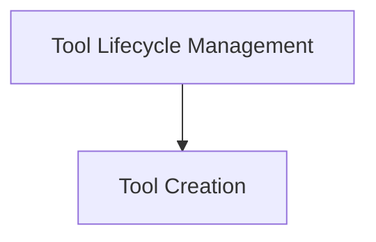
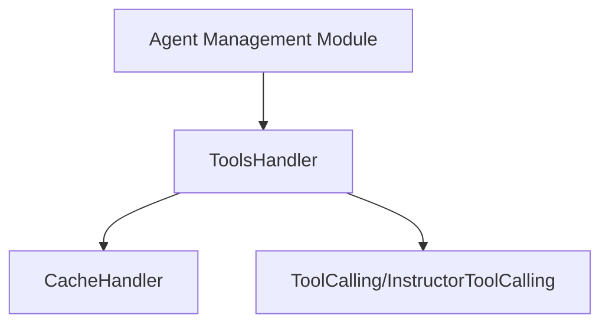

# Tool Management Module

## Introduction and Purpose

The `tool_management` module provides command-line interface (CLI) functionalities for interacting with and managing tools within the CrewAI ecosystem. It allows developers to create, install, and publish tools, streamlining the process of extending CrewAI's capabilities with custom or community-contributed tools.

## Architecture Overview

The `tool_management` module is composed of several key sub-modules that handle specific aspects of tool interaction. The overall architecture is designed to provide a clear separation of concerns, ensuring maintainability and scalability.

<!-- DIAGRAM_JSON
{
    "direction": "TD",
    "nodes": [
        {"id": "tool_creation", "label": "Tool Creation", "type": "module", "link": "tool_creation.md"},
        {"id": "tool_lifecycle_management", "label": "Tool Lifecycle Management", "type": "module", "link": "tool_lifecycle_management.md"}
    ],
    "edges": [
        {"source": "tool_lifecycle_management", "target": "tool_creation"}
    ],
    "groups": []
}
-->

## Sub-modules and their Functionality

### [Tool Creation](tool_creation.md)
This sub-module focuses on the initial creation of new tools. It provides the necessary commands and logic to scaffold a new tool project within the CrewAI environment.

### [Tool Lifecycle Management](tool_lifecycle_management.md)
This sub-module is responsible for managing the broader lifecycle of tools, encompassing their installation and publication. It includes functionalities for authenticating users and interacting with a tool registry to distribute and utilize tools.

## Purpose and Core Functionality

The `tool_management` module provides the `ToolsHandler` class, an essential mechanism for agents to interface with and manage various tools. It ensures that tool usage is tracked and, where appropriate, optimized through caching.

### `ToolsHandler`

-   **Purpose**: The `ToolsHandler` acts as a central callback handler for tools. It captures information about tool invocations and their results.
-   **Attributes**:
    -   `last_used_tool`: Stores the instance of the `ToolCalling` or `InstructorToolCalling` that was most recently executed by an agent. This provides immediate access to the details of the last operation.
    -   `cache`: An optional instance of a `CacheHandler`. If provided, it enables the caching of tool outputs, preventing re-execution of tools with identical inputs. This significantly improves efficiency for repetitive tasks.
-   **Method**:
    -   `on_tool_use(calling, output, should_cache)`: This method is invoked every time a tool completes its execution. It updates the `last_used_tool` attribute with the details of the completed tool call. If a `cache` is configured and `should_cache` is `True`, the tool's input arguments and output are stored in the cache. A notable exception is the `CacheTools` itself, whose outputs are not cached to avoid circular dependencies or unnecessary caching of cache operations.

## Architecture and Component Relationships

The `tool_management` module's architecture is centered around the `ToolsHandler`. It interacts with external components for caching and tool definition, and is integrated into the broader agent management system.

<!-- DIAGRAM_JSON
{
    "direction": "TD",
    "nodes": [
        {"id": "tools_handler", "label": "ToolsHandler", "type": "component", "link": null},
        {"id": "cache_handler", "label": "CacheHandler", "type": "external", "link": "crewai_files_cache.md"},
        {"id": "tool_calling_types", "label": "ToolCalling/InstructorToolCalling", "type": "external", "link": "crewai_tool_base.md"},
        {"id": "agent_management", "label": "Agent Management Module", "type": "external", "link": "crewai_agent_management.md"}
    ],
    "edges": [
        {"source": "tools_handler", "target": "cache_handler"},
        {"source": "tools_handler", "target": "tool_calling_types"},
        {"source": "agent_management", "target": "tools_handler"}
    ],
    "groups": []
}
-->

### Relationships:

-   **`ToolsHandler`**: The central component of this module, responsible for orchestrating tool usage callbacks and caching.
-   **`CacheHandler`** ([`crewai_files_cache.md`](crewai_files_cache.md)): The `ToolsHandler` optionally utilizes a `CacheHandler` to store and retrieve tool outputs, optimizing performance. This dependency highlights the importance of efficient data management within the CrewAI framework.
-   **`ToolCalling` / `InstructorToolCalling`** ([`crewai_tool_base.md`](crewai_tool_base.md)): These types define the structure and information passed when a tool is invoked. The `ToolsHandler` interacts directly with instances of these types to process tool execution details.
-   **`Agent Management Module`** ([`crewai_agent_management.md`](crewai_agent_management.md)): The `tool_management` module is a sub-module of `crewai_agent_management`, indicating that tool handling is an integral part of how agents operate and manage their tasks.

## How the Module Fits into the Overall System

The `tool_management` module, through its `ToolsHandler`, is a foundational piece in the CrewAI ecosystem, specifically within the agent's operational flow. It serves as the primary interface for agents to execute and manage external functionalities (tools).

By centralizing tool usage callbacks and implementing an optional caching mechanism, `tool_management` directly contributes to:

1.  **Agent Efficiency**: Caching tool outputs prevents redundant computations, speeding up agent execution, especially in scenarios where the same tool with the same inputs might be called multiple times.
2.  **Operational Transparency**: By tracking the `last_used_tool`, the system gains insight into the agent's immediate actions, which can be valuable for debugging, monitoring, and auditing.
3.  **System Scalability**: An efficient tool management system reduces the load on external services and APIs by leveraging cached results, making the overall system more scalable and robust.

Ultimately, `tool_management` ensures that agents can reliably and efficiently interact with their assigned tools, which is critical for the effective execution of complex multi-agent workflows.