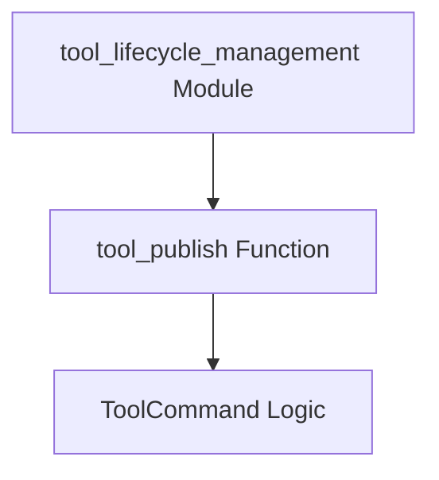

# Module: `tool_publishing`

## Introduction
The `tool_publishing` module is a core component within the CrewAI CLI's tool management system. It provides the functionality to publish tools, making them available for use within the CrewAI ecosystem. This module handles the process of authenticating with the tool registry and initiating the tool publication process.

## Purpose and Core Functionality
The primary purpose of the `tool_publishing` module is to facilitate the sharing and deployment of custom tools developed for CrewAI agents. It offers a command-line interface for developers to publish their tools, controlling their visibility (public or private) and handling potential conflicts through a force option.

The main functionality is encapsulated within the `tool_publish` function, which orchestrates the following steps:
1.  **Initialization**: Creates an instance of `ToolCommand` to manage the publishing process.
2.  **Authentication**: Logs the user into the tool publishing system.
3.  **Publication**: Executes the actual tool publication, with options for public visibility and forced updates.

## Architecture and Component Relationships

<!-- DIAGRAM_JSON
{
    "direction": "TD",
    "nodes": [
        {"id": "tool_publish_function", "label": "tool_publish Function", "type": "component", "link": null},
        {"id": "tool_command_logic", "label": "ToolCommand Logic", "type": "component", "link": null},
        {"id": "tool_lifecycle_management_module", "label": "tool_lifecycle_management Module", "type": "external", "link": "tool_lifecycle_management.md"}
    ],
    "edges": [
        {"source": "tool_publish_function", "target": "tool_command_logic"},
        {"source": "tool_lifecycle_management_module", "target": "tool_publish_function"}
    ],
    "groups": []
}
-->

### Component Breakdown:

*   **`tool_publish_function`**: This is the entry point for the tool publishing operation. It receives parameters regarding the tool's public status and whether to force the publication, and then delegates the core tasks to the `ToolCommand` logic.
*   **`ToolCommand Logic`**: This conceptual component represents the internal workings of the `ToolCommand` class, which handles the intricacies of user authentication (`login()`) and the actual interaction with the tool registry for publishing (`publish()`). While `ToolCommand` is instantiated within `tool_publish`, its detailed implementation for login and publishing resides elsewhere within the CLI or tool management infrastructure.

### External Dependencies:

*   **`tool_lifecycle_management` Module**: The `tool_publishing` module is a part of the `tool_lifecycle_management` module, which oversees various stages of a tool's existence, including installation and other management aspects. This module acts as a parent orchestrator for tool-related CLI commands.

## How the Module Fits into the Overall System
The `tool_publishing` module is an integral part of the CrewAI CLI (`crewai_cli.md`), specifically contributing to the `tool_management.md` domain. It provides the crucial capability for developers to contribute and update tools, enriching the toolset available to CrewAI agents. By abstracting the complexities of authentication and registry interaction, it streamlines the process of making tools discoverable and usable across different CrewAI projects. It relies on a broader `ToolCommand` implementation (likely found within `crewai_cli` itself or `crewai_tool_base.md` for base tool definitions) to perform its operations.
