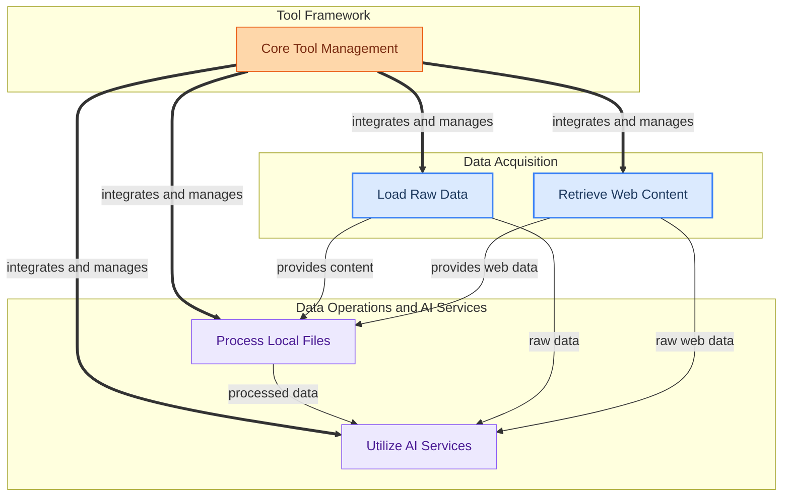

The `tools_and_integrations` module provides a comprehensive suite of capabilities for CrewAI agents to interact with external systems, process diverse data, and leverage specialized AI services. It establishes the foundational framework for creating, adapting, and managing various tools, enabling agents to perform tasks such as loading data from multiple sources, searching and scraping web content, processing local files (e.g., CSV, DOCX), and integrating with a wide array of AI-powered services like AWS Bedrock, Arxiv, and more. This module empowers agents with the necessary functionalities to gather information, manipulate data, and execute complex operations beyond their internal reasoning.

**Core Components Documentation:**

*   **Base Tooling**: Provides the fundamental framework for defining, validating, executing, and managing all tools within CrewAI, including conversions to and from Langchain formats.
    *   [Base Tool Management](base_tooling.md#base-tool-management)
    *   [Tool Adapters](base_tooling.md#tool-adapters)
*   **Data Loaders**: Offers a collection of classes for loading and processing diverse data sources, such as files (CSV, DOCX, PDF, JSON, XML, TXT), web content (Docs Sites, GitHub, Web Pages, YouTube), and databases (MySQL, PostgreSQL), along with text chunking capabilities.
    *   [Base RAG Components](data_loaders.md#base-rag-components)
    *   [Document and File Loaders](data_loaders.md#document-and-file-loaders)
    *   [Web and Database Loaders](data_loaders.md#web-and-database-loaders)
*   **Search and Scraping Tools**: A comprehensive suite of tools for web search, content extraction, and specialized data retrieval from various online sources, enabling agents to gather and process information efficiently.
    *   [Web Search Providers](search_and_scraping_tools.md#web-search-providers)
    *   [Web Content Extraction](search_and_scraping_tools.md#web-content-extraction)
    *   [Specialized Data Search](search_and_scraping_tools.md#specialized-data-search)
*   **Data Processing Tools**: Provides tools for interacting with various data sources and file systems, including searching within structured data formats (CSV, DOCX, JSON, MDX, PDF, TXT, XML, MySQL), reading and writing files, managing directories, and performing OCR on images.
    *   [Structured Data Search](data_processing_tools.md#structured-data-search)
    *   [File System Management](data_processing_tools.md#file-system-management)
    *   [Image Text Extraction](data_processing_tools.md#image-text-extraction)
*   **AI Service Tools**: A collection of tools for integrating with various AI-powered services, including AWS Bedrock agents, browser toolkits, code interpreters, knowledge base retrievers, AI-Minds, Apify actors, Arxiv paper search, and more.
    *   [AWS Bedrock Tools](ai_service_tools.md#aws-bedrock-tools)
    *   [Other AI Service Integrations](ai_service_tools.md#other-ai-service-integrations)