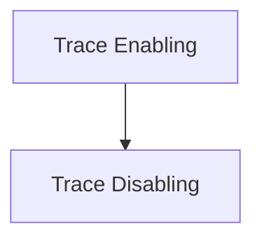

# Trace Control Module

## Introduction

The `trace_control` module provides command-line interface functionalities to enable or disable trace collection for CrewAI and Flow executions. It allows users to manage whether execution traces are sent to CrewAI+ for monitoring and debugging purposes.

## Architecture Overview

This module is part of the `crewai_cli.trace_management` sub-system, focusing specifically on the user-facing controls for trace collection. It interacts with the `crewai.events.listeners.tracing.utils` module to persist user preferences regarding trace consent.

<!-- DIAGRAM_JSON
{
    "direction": "TD",
    "nodes": [
        {"id": "trace_enabling", "label": "Trace Enabling", "type": "module", "link": "trace_enabling.md"},
        {"id": "trace_disabling", "label": "Trace Disabling", "type": "module", "link": "trace_disabling.md"}
    ],
    "edges": [
        {"source": "trace_enabling", "target": "trace_disabling"}
    ],
    "groups": []
}
-->

## Sub-modules

### [Trace Enabling](trace_enabling.md)

This sub-module contains the logic and implementation for enabling trace collection. It sets the user's trace consent to `True`, allowing execution traces to be sent to CrewAI+.

### [Trace Disabling](trace_disabling.md)

This sub-module provides the functionality to disable trace collection. It sets the user's trace consent to `False`, preventing execution traces from being sent.
