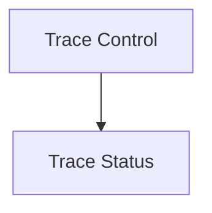

# Trace Management Module Documentation

## Introduction
The `trace_management` module provides command-line interface (CLI) functionalities within the `crewai` system for managing the collection of execution traces. These traces are crucial for monitoring and debugging crew/flow executions, offering insights into their performance and behavior.

## Architecture Overview
The `trace_management` module is a part of the [crewai_cli.md](crewai_cli.md) module and interacts with the `crewai_event_system` (specifically the `tracing.utils` sub-module for updating user data and checking trace status). It is divided into two main sub-modules: `trace_control` and `trace_status`, which handle enabling/disabling trace collection and displaying its current status, respectively.

<!-- DIAGRAM_JSON
{
    "direction": "TD",
    "nodes": [
        {"id": "trace_control", "label": "Trace Control", "type": "module", "link": "trace_control.md"},
        {"id": "trace_status", "label": "Trace Status", "type": "module", "link": "trace_status.md"}
    ],
    "edges": [
        {"source": "trace_control", "target": "trace_status"}
    ],
    "groups": []
}
-->

## Sub-module Functionality
- **Trace Control:** This sub-module provides utilities to enable or disable the collection of execution traces. For more details, refer to [trace_control.md](trace_control.md).
- **Trace Status:** This sub-module allows users to view the current status of trace collection, taking into account both user consent and environment variable configurations. For more details, refer to [trace_status.md](trace_status.md).