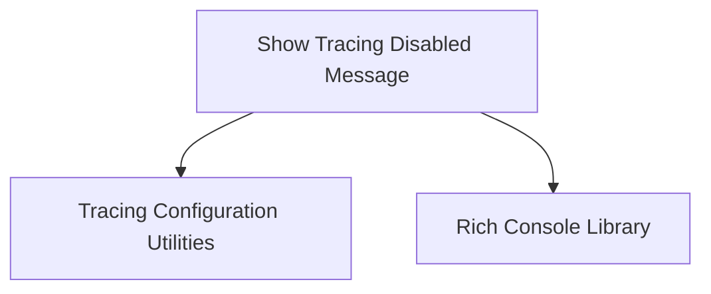

# Tracing Messages Module

## Introduction
The `tracing_messages` module is a crucial part of the CrewAI framework, specifically within the flow management system. Its primary role is to provide clear and informative feedback to users regarding the status of tracing, particularly when tracing is disabled. This ensures users are aware of the current tracing state and understand how to enable it for debugging or monitoring purposes.

## Purpose and Core Functionality
The main purpose of this module is to enhance the user experience by delivering actionable messages related to tracing. Its core functionality revolves around a single key component:

*   `_show_tracing_disabled_message`: This function is responsible for detecting if tracing is disabled and, if so, presenting a user-friendly message to the console. It intelligently adapts the message based on whether the user has explicitly declined tracing or if it's simply not enabled by default. The messages also provide clear instructions on how to enable tracing through code, environment variables, or CLI commands.

## Architecture and Component Relationships

<!-- DIAGRAM_JSON
{
    "direction": "TD",
    "nodes": [
        {"id": "_show_tracing_disabled_message", "label": "Show Tracing Disabled Message", "type": "component", "link": null},
        {"id": "tracing_config", "label": "Tracing Configuration Utilities", "type": "external", "link": "tracing_config.md"},
        {"id": "rich_console", "label": "Rich Console Library", "type": "external", "link": null}
    ],
    "edges": [
        {"source": "_show_tracing_disabled_message", "target": "tracing_config"},
        {"source": "_show_tracing_disabled_message", "target": "rich_console"}
    ],
    "groups": []
}
-->

The `tracing_messages` module, primarily through its `_show_tracing_disabled_message` function, interacts with the following:
*   **Tracing Configuration Utilities (`tracing_config`)**: This external conceptual module (or set of functions) provides information on whether tracing messages should be suppressed and if the user has actively declined tracing. This interaction dictates the content of the message displayed to the user.
*   **Rich Console Library (`rich_console`)**: An external library used for formatting and printing rich text to the terminal, ensuring that tracing status messages are presented clearly and attractively.

## Integration with Overall System
The `tracing_messages` module is nested within the `crewai_flow_management` system, specifically under `flow_core` and `flow_utility_and_tracing`. Its integration ensures that any user running CrewAI flows is informed about tracing status, thereby improving the debugging and monitoring experience without being intrusive. It serves as a helpful guide for users to leverage CrewAI's tracing capabilities effectively.

For more details on how tracing integrates with the overall flow utility, refer to the [flow_utility_and_tracing.md](flow_utility_and_tracing.md) documentation.
