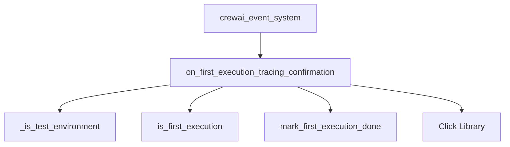

# `tracing_utilities` Module Documentation

## Introduction

The `tracing_utilities` module is a crucial part of the `crewai_event_system`, specifically designed to manage the initial user interaction regarding tracing enablement. Its primary function is to detect the first execution of the CrewAI application and prompt the user to decide whether to activate system-wide tracing. This ensures that users are aware of and consent to tracing activities from the outset.

## Architecture and Component Relationships

The `tracing_utilities` module contains core logic for determining the application's execution state and interacting with the user for tracing confirmation. Its main component, `on_first_execution_tracing_confirmation`, orchestrates this process.

### `on_first_execution_tracing_confirmation`

This function is responsible for:
-   Checking if the current environment is a test environment, in which case tracing is not enabled.
-   Verifying if it is indeed the first execution of the application.
-   If it's the first execution and not a test environment, it prompts the user with a confirmation dialog (powered by the `click` library) to enable tracing.
-   It marks the first execution as done to prevent repeated prompts.

This component relies on several internal utility functions for its operation:
-   `_is_test_environment()`: Determines if the application is running within a test suite.
-   `is_first_execution()`: Checks a persistent flag to ascertain if this is the very first run.
-   `mark_first_execution_done()`: Updates the persistent flag after the first execution has been handled.

### Integration with `crewai_event_system`

The `tracing_utilities` module is a sub-module of `crewai_event_system`, indicating its role in event listening and system setup. It ensures that the tracing mechanism, which is integral to understanding system flow and debugging, is initiated based on user preference during the initial application lifecycle.

<!-- DIAGRAM_JSON
{
    "direction": "TD",
    "nodes": [
        {"id": "on_first_execution_tracing_confirmation", "label": "on_first_execution_tracing_confirmation", "type": "component", "link": null},
        {"id": "is_test_environment", "label": "_is_test_environment", "type": "component", "link": null},
        {"id": "is_first_execution", "label": "is_first_execution", "type": "component", "link": null},
        {"id": "mark_first_execution_done", "label": "mark_first_execution_done", "type": "component", "link": null},
        {"id": "click_library", "label": "Click Library", "type": "external", "link": null},
        {"id": "crewai_event_system", "label": "crewai_event_system", "type": "external", "link": "crewai_event_system.md"}
    ],
    "edges": [
        {"source": "on_first_execution_tracing_confirmation", "target": "is_test_environment"},
        {"source": "on_first_execution_tracing_confirmation", "target": "is_first_execution"},
        {"source": "on_first_execution_tracing_confirmation", "target": "mark_first_execution_done"},
        {"source": "on_first_execution_tracing_confirmation", "target": "click_library"},
        {"source": "crewai_event_system", "target": "on_first_execution_tracing_confirmation"}
    ],
    "groups": []
}
-->

