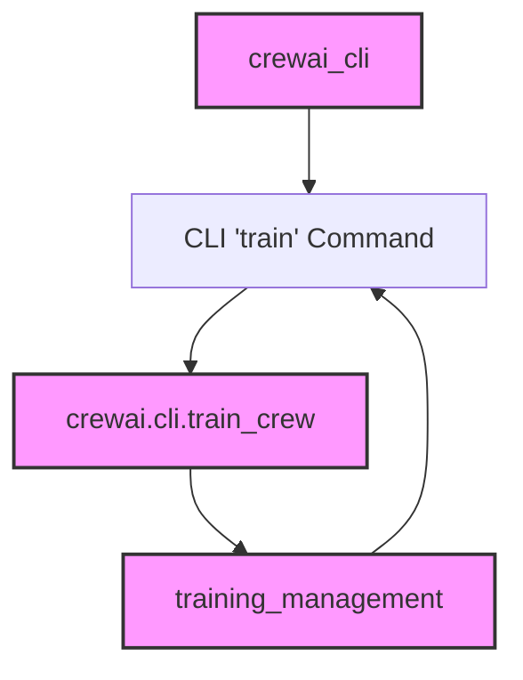

# Module: `train_functionality`

## Introduction
The `train_functionality` module encapsulates the command-line interface (CLI) functionality for initiating the training process of a Crew AI agent. It provides the entry point for users to train their crews with a specified number of iterations and a custom filename for storing training data.

## Purpose and Core Functionality
This module's primary purpose is to expose the training capabilities of the Crew AI system through a user-friendly CLI command. The core functionality is provided by the `train` command, which orchestrates the training workflow by invoking the underlying training logic.

### Core Component: `lib.crewai.src.crewai.cli.cli.train`
The `train` function serves as the CLI command handler for training.

```python
def train(n_iterations: int, filename: str) -> None:
    """Train the crew."""
    click.echo(f"Training the Crew for {n_iterations} iterations")
    train_crew(n_iterations, filename)
```

**Parameters:**
- `n_iterations` (int): The number of iterations to train the crew. Defaults to 5.
- `filename` (str): The path to a custom file for training data. Defaults to "trained_agents_data.pkl".

**Workflow:**
1.  When the `crewai train` command is executed, this `train` function is invoked.
2.  It uses `click.echo` to inform the user about the training process.
3.  It then calls the `train_crew` function, passing the specified number of iterations and filename to it, which handles the actual training logic.

## Architecture and Component Relationships

The `train_functionality` module, represented by the `train` CLI command, is a key part of the `crewai_cli`. It acts as a bridge between the user's command and the core training mechanisms.

It depends on the `train_crew` function, which is imported from the `crewai.cli.train_crew` module, to execute the actual training operations. This design separates the command-line interface concerns from the core business logic of training.

<!-- DIAGRAM_JSON
{
    "direction": "TD",
    "nodes": [
        {"id": "train_command", "label": "CLI 'train' Command", "type": "component", "link": null},
        {"id": "cli_module", "label": "crewai_cli", "type": "external", "link": "crewai_cli.md"},
        {"id": "train_crew_module", "label": "crewai.cli.train_crew", "type": "external", "link": "train_crew.md"},
        {"id": "training_management_module", "label": "training_management", "type": "external", "link": "training_management.md"}
    ],
    "edges": [
        {"source": "cli_module", "target": "train_command"},
        {"source": "train_command", "target": "train_crew_module"},
        {"source": "training_management_module", "target": "train_command"},
        {"source": "train_crew_module", "target": "training_management_module"}
    ],
    "groups": []
}
-->


## How the Module Fits into the Overall System
The `train_functionality` module is an integral part of the Crew AI CLI, specifically residing within the `training_management` section of the `crewai_cli`. It provides the user-facing entry point for initiating and managing the training of AI crews.

It integrates with:
-   **`crewai_cli`**: As a core command within the CLI, it allows users to interact with the training system.
-   **`crewai.cli.train_crew`**: This module provides the underlying implementation for the training process, separating the command interface from the actual training logic.
-   **`training_management`**: This parent module likely oversees broader aspects of training, and `train_functionality` contributes by providing the mechanism to start a training run.
