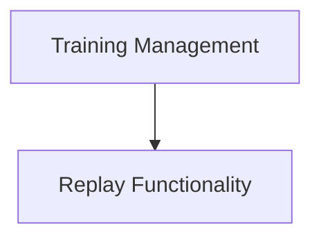

# Training and Evaluation Module

## Introduction

The `training_and_evaluation` module provides command-line interface (CLI) functionalities for managing the training, replaying, and testing of CrewAI crews. It allows users to train crews for a specified number of iterations, replay past crew executions for debugging or analysis, and evaluate crew performance against a given model.

## Architecture Overview

The `training_and_evaluation` module is a part of the CrewAI CLI, focusing on the lifecycle management of a crew's execution and performance. It interacts with core CrewAI functionalities to initiate training, control replay mechanisms, and conduct evaluations.

<!-- DIAGRAM_JSON
{
    "direction": "TD",
    "nodes": [
        {"id": "training_management", "label": "Training Management", "type": "module", "link": "training_management.md"},
        {"id": "replay_functionality", "label": "Replay Functionality", "type": "module", "link": "replay_functionality.md"}
    ],
    "edges": [
        {"source": "training_management", "target": "replay_functionality"}
    ],
    "groups": []
}
-->

## Sub-modules

- ### [Training Management](training_management.md)
  Handles the training and evaluation processes for the crew, including initiating training iterations and testing crew performance.

- ### [Replay Functionality](replay_functionality.md)
  Manages the replaying of crew executions from specific tasks, useful for debugging and analysis.
