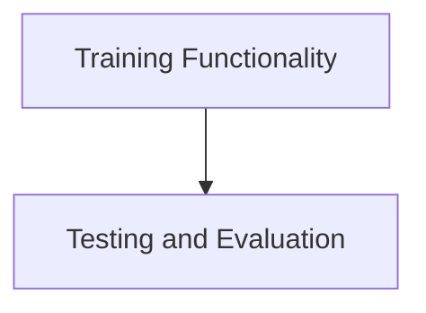

# Training Management Module

## Introduction
The `training_management` module, a crucial part of the `crewai_cli` package, provides functionalities for training and testing AI crews. It allows users to iterate on crew training and evaluate their performance against specified models, ensuring robust and efficient AI agent operations.

## Architecture Overview
The `training_management` module is composed of two primary sub-modules: `training_functionality` and `test_and_evaluation`. These sub-modules work in tandem to provide a complete lifecycle for optimizing and validating AI crews within the CrewAI framework.

<!-- DIAGRAM_JSON
{
    "direction": "TD",
    "nodes": [
        {"id": "train_functionality", "label": "Training Functionality", "type": "module", "link": "train_functionality.md"},
        {"id": "test_and_evaluation", "label": "Testing and Evaluation", "type": "module", "link": "test_and_evaluation.md"}
    ],
    "edges": [
        {"source": "train_functionality", "target": "test_and_evaluation"}
    ],
    "groups": []
}
-->

## Sub-modules

### Training Functionality ([`train_functionality.md`](train_functionality.md))
This sub-module encapsulates the core logic for training a CrewAI agent. It facilitates the iterative training process, allowing for the refinement and optimization of agent behaviors over a specified number of iterations.

### Testing and Evaluation ([`test_and_evaluation.md`](test_and_evaluation.md))
Responsible for assessing the performance of trained CrewAI agents, this sub-module provides tools to test the crew against various models and evaluate the results. It plays a critical role in validating the effectiveness of the training process and ensuring the agent meets desired performance benchmarks.