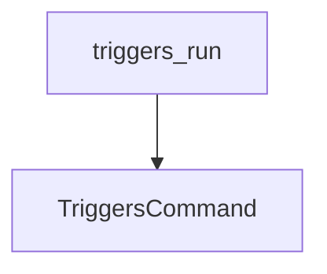

# trigger_execution Module Documentation

## Introduction
The `trigger_execution` module is a vital part of the CrewAI Command Line Interface (CLI), specifically designed to enable the execution of predefined triggers within the CrewAI ecosystem. It serves as the direct interface for users to activate automated workflows based on their specified trigger paths.

## Purpose and Core Functionality
The primary purpose of the `trigger_execution` module is to provide a command-line entry point for running triggers. Its core functionality is encapsulated in the `triggers_run` function, which takes a `trigger_path` as an argument. This path identifies the specific trigger (e.g., `app_slug/trigger_slug`) to be executed. The module delegates the actual execution logic to the `TriggersCommand` component, ensuring a clear separation of concerns and efficient handling of trigger-related operations.

## Architecture and Component Relationships

The `trigger_execution` module is a leaf module within the `crewai_cli.trigger_integration.trigger_management` structure. It directly interacts with the `TriggersCommand` to perform its operations.

<!-- DIAGRAM_JSON
{
    "direction": "TD",
    "nodes": [
        {"id": "triggers_run", "label": "triggers_run", "type": "component", "link": null},
        {"id": "triggers_command", "label": "TriggersCommand", "type": "external", "link": "trigger_management.md"}
    ],
    "edges": [
        {"source": "triggers_run", "target": "triggers_command"}
    ],
    "groups": []
}
-->

## How it Fits into the Overall System
The `trigger_execution` module is an integral part of the CrewAI CLI, providing users with the ability to manually or programmatically initiate workflows via triggers. It resides within the `trigger_management` module, which is responsible for overall trigger-related operations including listing and execution. This module's existence allows for seamless integration of external events or scheduled tasks into CrewAI agentic workflows by providing a robust command-line interface to activate them. It ensures that the CLI remains a powerful tool for managing and interacting with various aspects of the CrewAI system, especially in the context of automated operations.
