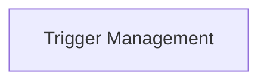

# Trigger Integration Module

## Introduction

The `trigger_integration` module is a vital component of the CrewAI CLI, designed to manage and execute integration triggers. It provides functionalities to list available triggers and to run a crew with a specific trigger payload, enabling seamless interaction with external systems and automated workflows.

## Architecture Overview

The `trigger_integration` module primarily interacts with the `TriggersCommand` to abstract the underlying logic for trigger operations. It acts as the entry point for CLI commands related to triggers, delegating the actual processing to dedicated sub-modules.

<!-- DIAGRAM_JSON
{
    "direction": "TD",
    "nodes": [
        {"id": "trigger_management", "label": "Trigger Management", "type": "module", "link": "trigger_management.md"}
    ],
    "edges": [],
    "groups": []
}
-->

## Sub-modules

### Trigger Management (`trigger_management.md`)

This sub-module is responsible for the core functionalities of listing and executing integration triggers. It utilizes the `TriggersCommand` to interact with the system's trigger mechanisms. Refer to the [Trigger Management documentation](trigger_management.md) for more details.