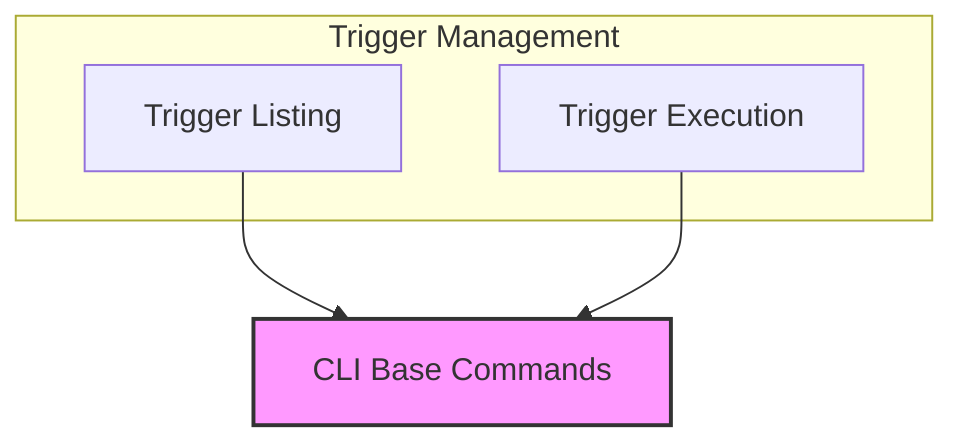

# Trigger Management Module

The `trigger_management` module is a core component within the CrewAI CLI responsible for interacting with and managing various triggers from integrated applications. It provides functionalities to list available triggers and to execute a CrewAI crew based on a specific trigger payload.

## Architecture

This module primarily orchestrates interactions with a `TriggersCommand` internal utility to perform its operations. It is composed of two main sub-modules:

- **Trigger Listing**: Responsible for enumerating all configured triggers.
- **Trigger Execution**: Handles the activation of a CrewAI workflow using a specified trigger.

<!-- DIAGRAM_JSON
{
    "direction": "TD",
    "nodes": [
        {"id": "trigger_listing", "label": "Trigger Listing", "type": "module", "link": "trigger_listing.md"},
        {"id": "trigger_execution", "label": "Trigger Execution", "type": "module", "link": "trigger_execution.md"}
    ],
    "edges": [
        {"source": "trigger_listing", "target": "cli_base_commands"},
        {"source": "trigger_execution", "target": "cli_base_commands"}
    ],
    "groups": []
}
-->

## Sub-modules

### [Trigger Listing](trigger_listing.md)

This sub-module provides the functionality to list all available triggers configured within the CrewAI environment. It helps users discover what automation points are integrated and ready for use.

### [Trigger Execution](trigger_execution.md)

The trigger execution sub-module enables the direct execution of a CrewAI crew by referencing a specific trigger path (e.g., `app_slug/trigger_slug`). It serves as the entry point for initiating automated workflows based on external or internal events.