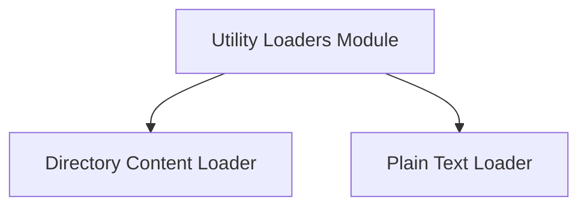

# Utility Loaders Module

The `utility_loaders` module provides essential functionalities for loading various types of content into the CrewAI RAG (Retrieval Augmented Generation) system. It abstracts away the complexities of reading data from different sources, offering a unified interface for data ingestion.

## Architecture Overview

This module is composed of specialized loaders, each designed to handle specific data sources. The architecture ensures extensibility, allowing new loaders to be easily integrated for different content types or platforms.

<!-- DIAGRAM_JSON
{
    "direction": "TD",
    "nodes": [
        {"id": "directory_content_loader", "label": "Directory Content Loader", "type": "module", "link": "directory_content_loader.md"},
        {"id": "plain_text_loader", "label": "Plain Text Loader", "type": "module", "link": "plain_text_loader.md"}
    ],
    "edges": [],
    "groups": []
}
-->

## Sub-modules

### [Directory Content Loader](directory_content_loader.md)

This sub-module is responsible for loading and processing files from a specified directory. It supports recursive searching, inclusion/exclusion filtering based on file extensions, and limits on the number of files to process. It is crucial for ingesting local file system data into the RAG system.

### [Plain Text Loader](plain_text_loader.md)

The `plain_text_loader` sub-module handles the direct loading of raw text content. It's a straightforward loader used for ingesting textual data without complex parsing or file system navigation, making it ideal for simple string inputs.