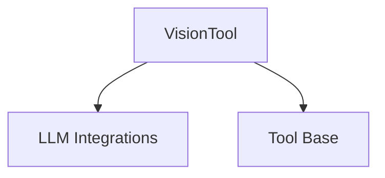

# vision_tool_module

The `vision_tool_module` provides a powerful `VisionTool` designed to enable AI agents to interact with vision models for image analysis and description. This module is a crucial component within the `crewai_tools_ai_model_tools` ecosystem, allowing agents to understand and interpret visual content by leveraging advanced vision APIs.

## Purpose and Core Functionality

The primary purpose of the `vision_tool_module` is to facilitate image analysis for AI agents. Its core functionality is encapsulated within the `VisionTool` class, which acts as an interface to vision models, particularly OpenAI's Vision API.

### `VisionTool` Class

The `VisionTool` class extends `BaseTool` and offers the following capabilities:

*   **Image Analysis**: Takes an image (either via a URL or a local file path) and a prompt, then utilizes a vision model to generate a textual description or answer questions about the image's content.
*   **Flexible LLM Integration**: Can be initialized with an optional `LLM` instance or a specified model identifier (defaulting to "gpt-4o-mini"). If no `LLM` is provided, it automatically instantiates one based on the `model` parameter.
*   **Environment Variable Management**: Automatically checks for the `OPENAI_API_KEY` environment variable, which is mandatory for its operation.
*   **Image Handling**:
    *   Directly uses image URLs for analysis.
    *   Encodes local image files into base64 format for submission to the vision API.
*   **Error Handling**: Includes robust error handling to manage issues during image processing or API calls.

**Key Components:**

*   **`VisionTool`**: The main class providing the image analysis functionality.
*   **`ImagePromptSchema`**: A Pydantic `BaseModel` used to validate the input arguments for the `VisionTool`, ensuring that a `image_path_url` is always provided.
*   **`_encode_image`**: A static helper method responsible for converting local image files into base64 strings.

## Architecture and Component Relationships

The `vision_tool_module` is structured around the `VisionTool` class, which orchestrates interactions with external LLM services and handles image data preparation.

<!-- DIAGRAM_JSON
{
    "direction": "TD",
    "nodes": [
        {"id": "vision_tool", "label": "VisionTool", "type": "component", "link": null},
        {"id": "llm_integration", "label": "LLM Integrations", "type": "external", "link": "crewai_llm_integrations.md"},
        {"id": "base_tool_module", "label": "Tool Base", "type": "external", "link": "crewai_tool_base.md"}
    ],
    "edges": [
        {"source": "vision_tool", "target": "llm_integration"},
        {"source": "vision_tool", "target": "base_tool_module"}
    ],
    "groups": []
}
-->

**Relationships:**

*   **`VisionTool`** uses components from the `crewai_llm_integrations` module (specifically the `LLM` class) to make calls to vision models.
*   **`VisionTool`** inherits from `BaseTool`, which is defined in the `crewai_tool_base` module, providing the foundational structure for CrewAI tools.

## Integration with the Overall System

The `vision_tool_module` is a specialized tool under `crewai_tools_ai_model_tools`, which is part of the broader CrewAI toolkit. It extends the capabilities of AI agents by allowing them to perceive and interpret visual information, making them more versatile for tasks requiring image understanding.

Agents can utilize the `VisionTool` to:
*   Describe scenes or objects in images.
*   Answer questions based on visual input.
*   Perform content moderation or analysis on images.

This integration empowers agents to tackle a wider range of complex problems that involve both textual and visual data.
