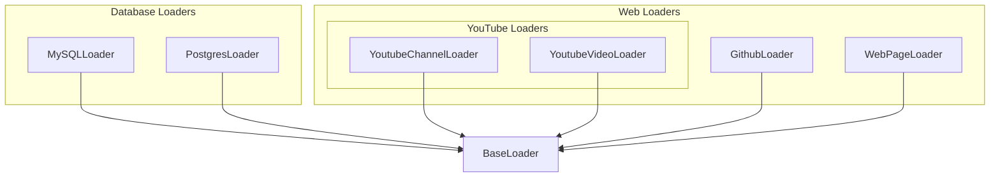

# web_and_database_loaders
This module provides a collection of specialized loaders for retrieving content from various web sources like GitHub, general webpages, and YouTube, as well as from relational databases such as MySQL and PostgreSQL.

<!-- DIAGRAM_JSON
{
    "nodes": [
        {
            "id": "A",
            "label": "BaseLoader"
        },
        {
            "id": "B",
            "label": "GithubLoader"
        },
        {
            "id": "C",
            "label": "MySQLLoader"
        },
        {
            "id": "D",
            "label": "PostgresLoader"
        },
        {
            "id": "E",
            "label": "WebPageLoader"
        },
        {
            "id": "F",
            "label": "YoutubeChannelLoader"
        },
        {
            "id": "G",
            "label": "YoutubeVideoLoader"
        }
    ],
    "edges": [
        {
            "source": "B",
            "target": "A"
        },
        {
            "source": "C",
            "target": "A"
        },
        {
            "source": "D",
            "target": "A"
        },
        {
            "source": "E",
            "target": "A"
        },
        {
            "source": "F",
            "target": "A"
        },
        {
            "source": "G",
            "target": "A"
        }
    ],
    "groups": [
        {
            "id": "web_loaders",
            "label": "Web Loaders",
            "nodes": [
                "B",
                "E",
                "F",
                "G"
            ],
            "groups": [
                {
                    "id": "youtube_loaders",
                    "label": "YouTube Loaders",
                    "nodes": [
                        "F",
                        "G"
                    ]
                }
            ]
        },
        {
            "id": "db_loaders",
            "label": "Database Loaders",
            "nodes": [
                "C",
                "D"
            ]
        }
    ]
}
-->
