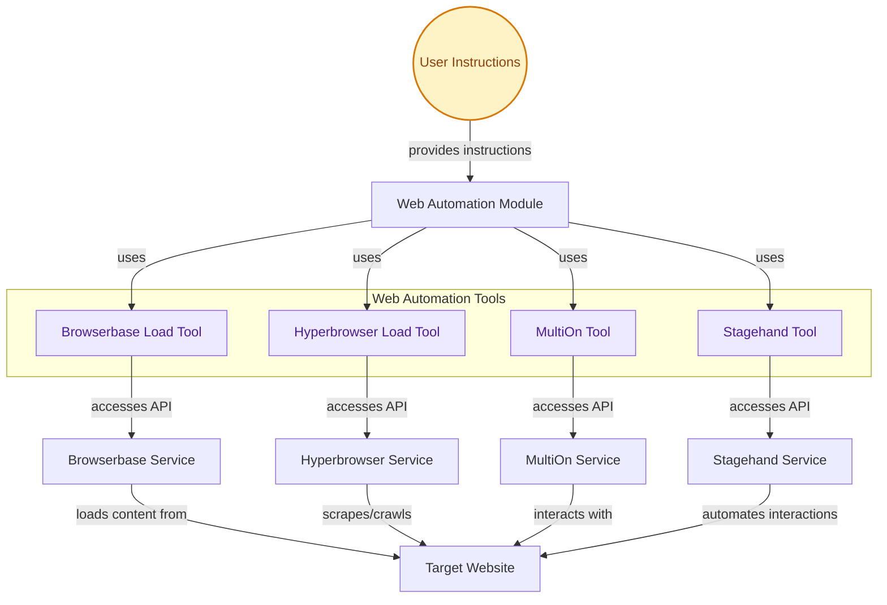

## Web Automation Tools

This module offers a suite of tools for automating web interactions, including loading pages, scraping content, and controlling browsers via natural language, by integrating with external services like Browserbase, Hyperbrowser, MultiOn, and Stagehand.

<!-- DIAGRAM_JSON
{
    "direction": "TD",
    "nodes": [
        {"id": "user_instruction", "label": "User Instructions", "type": "external", "link": null},
        {"id": "web_automation_module", "label": "Web Automation Module", "type": "component", "link": null},
        {"id": "browserbase_load_tool", "label": "Browserbase Load Tool", "type": "component", "link": null},
        {"id": "hyperbrowser_load_tool", "label": "Hyperbrowser Load Tool", "type": "component", "link": null},
        {"id": "multion_tool", "label": "MultiOn Tool", "type": "component", "link": null},
        {"id": "stagehand_tool", "label": "Stagehand Tool", "type": "component", "link": null},
        {"id": "web_browserbase", "label": "Browserbase Service", "type": "external", "link": null},
        {"id": "web_hyperbrowser", "label": "Hyperbrowser Service", "type": "external", "link": null},
        {"id": "web_multion", "label": "MultiOn Service", "type": "external", "link": null},
        {"id": "web_stagehand", "label": "Stagehand Service", "type": "external", "link": null},
        {"id": "web_target_site", "label": "Target Website", "type": "external", "link": null}
    ],
    "edges": [
        {"source": "user_instruction", "target": "web_automation_module", "label": "provides instructions"},
        {"source": "web_automation_module", "target": "browserbase_load_tool", "label": "uses"},
        {"source": "web_automation_module", "target": "hyperbrowser_load_tool", "label": "uses"},
        {"source": "web_automation_module", "target": "multion_tool", "label": "uses"},
        {"source": "web_automation_module", "target": "stagehand_tool", "label": "uses"},
        {"source": "browserbase_load_tool", "target": "web_browserbase", "label": "accesses API"},
        {"source": "hyperbrowser_load_tool", "target": "web_hyperbrowser", "label": "accesses API"},
        {"source": "multion_tool", "target": "web_multion", "label": "accesses API"},
        {"source": "stagehand_tool", "target": "web_stagehand", "label": "accesses API"},
        {"source": "web_browserbase", "target": "web_target_site", "label": "loads content from"},
        {"source": "web_hyperbrowser", "target": "web_target_site", "label": "scrapes/crawls"},
        {"source": "web_multion", "target": "web_target_site", "label": "interacts with"},
        {"source": "web_stagehand", "target": "web_target_site", "label": "automates interactions"}
    ],
    "groups": [
        {"id": "web_automation_tools", "label": "Web Automation Tools", "role": "analytical", "nodes": ["browserbase_load_tool", "hyperbrowser_load_tool", "multion_tool", "stagehand_tool"]}
    ]
}
-->

