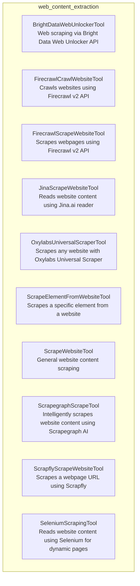

# web_content_extraction
This module provides a collection of tools designed for various web content extraction tasks, including general scraping, targeted element extraction, and advanced scraping using specialized APIs and headless browsers.

<!-- DIAGRAM_JSON
{
  "nodes": [
    {"id": "BrightDataWebUnlockerTool", "label": "BrightDataWebUnlockerTool", "description": "A tool for performing web scraping using the Bright Data Web Unlocker API."},
    {"id": "FirecrawlCrawlWebsiteTool", "label": "FirecrawlCrawlWebsiteTool", "description": "Tool for crawling websites using Firecrawl v2 API."},
    {"id": "FirecrawlScrapeWebsiteTool", "label": "FirecrawlScrapeWebsiteTool", "description": "Tool for scraping webpages using Firecrawl v2 API."},
    {"id": "JinaScrapeWebsiteTool", "label": "JinaScrapeWebsiteTool", "description": "A tool that can be used to read a website content using Jina.ai reader and return markdown content."},
    {"id": "OxylabsUniversalScraperTool", "label": "OxylabsUniversalScraperTool", "description": "Scrape any website with OxylabsUniversalScraperTool."},
    {"id": "ScrapeElementFromWebsiteTool", "label": "ScrapeElementFromWebsiteTool", "description": "A tool that can be used to read a specific element from a website content."},
    {"id": "ScrapeWebsiteTool", "label": "ScrapeWebsiteTool", "description": "A tool that can be used to read general website content."},
    {"id": "ScrapegraphScrapeTool", "label": "ScrapegraphScrapeTool", "description": "A tool that uses Scrapegraph AI to intelligently scrape website content."},
    {"id": "ScrapflyScrapeWebsiteTool", "label": "ScrapflyScrapeWebsiteTool", "description": "Scrape a webpage url using Scrapfly and return its content as markdown or text."},
    {"id": "SeleniumScrapingTool", "label": "SeleniumScrapingTool", "description": "A tool that can be used to read a website content using Selenium for dynamic pages."}
  ],
  "edges": [],
  "groups": [
    {"id": "web_content_extraction", "label": "web_content_extraction", "contains": [
      "BrightDataWebUnlockerTool",
      "FirecrawlCrawlWebsiteTool",
      "FirecrawlScrapeWebsiteTool",
      "JinaScrapeWebsiteTool",
      "OxylabsUniversalScraperTool",
      "ScrapeElementFromWebsiteTool",
      "ScrapeWebsiteTool",
      "ScrapegraphScrapeTool",
      "ScrapflyScrapeWebsiteTool",
      "SeleniumScrapingTool"
    ]}
  ]
}
-->
