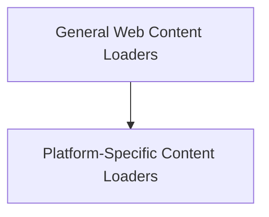

# Web Loaders Module

## Introduction and Purpose

The `web_loaders` module is a crucial part of the `crewai_tools.rag.loaders.data_loaders` package, responsible for fetching and parsing content from various web sources. It provides specialized loaders for documentation sites, generic web pages, GitHub repositories, and YouTube channels/videos, enabling the RAG (Retrieval Augmented Generation) system to incorporate up-to-date and diverse web-based information.

This module is designed to abstract the complexities of web scraping and API interactions, offering a unified interface for retrieving structured or semi-structured data from the internet, which can then be used by other components of the CrewAI system for knowledge retrieval and augmentation.

## Architecture Overview

The `web_loaders` module is composed of two main sub-modules, each specializing in different types of web content: `general_web_content_loaders` and `platform_specific_content_loaders`.

The module's architecture allows for extensible and maintainable web content retrieval. Each loader handles the specifics of its target source, from HTTP requests and HTML parsing to API interactions for platforms like GitHub and YouTube. The `LoaderResult` object ensures a consistent output format, facilitating integration with downstream RAG components.

<!-- DIAGRAM_JSON
{
    "direction": "TD",
    "nodes": [
        {"id": "general_web_content_loaders", "label": "General Web Content Loaders", "type": "module", "link": "general_web_content_loaders.md"},
        {"id": "platform_specific_content_loaders", "label": "Platform-Specific Content Loaders", "type": "module", "link": "platform_specific_content_loaders.md"}
    ],
    "edges": [
        {"source": "general_web_content_loaders", "target": "platform_specific_content_loaders"}
    ],
    "groups": []
}
-->

## Sub-modules

### [General Web Content Loaders](general_web_content_loaders.md)
This sub-module focuses on extracting information from standard web pages and documentation sites. It includes components like `DocsSiteLoader` for structured documentation and `WebPageLoader` for general HTML content.

### [Platform-Specific Content Loaders](platform_specific_content_loaders.md)
This sub-module provides specialized loaders for popular platforms. It contains `GithubLoader` for fetching repository information and `YoutubeChannelLoader`/`YoutubeVideoLoader` for extracting data from YouTube.