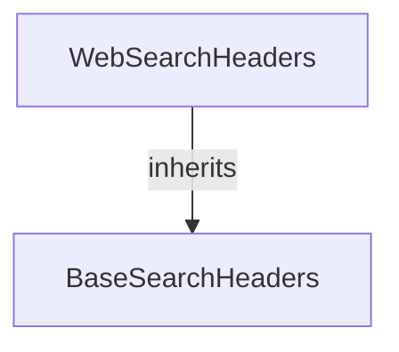

# `web_search_headers_module`

## Introduction

The `web_search_headers_module` defines the `WebSearchHeaders` class, which is responsible for encapsulating various location-based headers used in web search requests. These headers provide crucial geographical context, such as latitude, longitude, city, state, country, and postal code, to enhance the relevance and accuracy of search results.

## Core Functionality

This module primarily exposes the `WebSearchHeaders` Pydantic model. This model extends `BaseSearchHeaders` and includes fields for specifying detailed location information. Each field is designed to map directly to a header in a web search request, allowing for precise geographical targeting.

### `WebSearchHeaders` Class

The `WebSearchHeaders` class is a data model for representing geographical search headers. It includes the following fields:

*   `x_loc_lat`: Latitude of the user's location.
*   `x_loc_long`: Longitude of the user's location.
*   `x_loc_timezone`: Timezone of the user's location.
*   `x_loc_city`: City of the user's location.
*   `x_loc_state`: State of the user's location.
*   `x_loc_state_name`: Name of the state of the user's location.
*   `x_loc_country`: ISO 3166-1 alpha-2 country code of the user's location.
*   `x_loc_postal_code`: Postal code of the user's location.

All fields are optional and are designed to be used as HTTP headers (indicated by the `x-loc-` prefix and `alias` argument).

## Architecture and Component Relationships

The `web_search_headers_module` is a leaf module within the `crewai_tools_web_search` ecosystem, specifically nested under `search_api_schemas` and `location_search_headers`. It provides a concrete implementation for location-specific headers.

<!-- DIAGRAM_JSON
{
    "direction": "TD",
    "nodes": [
        {"id": "web_search_headers", "label": "WebSearchHeaders", "type": "component", "link": null},
        {"id": "base_search_headers", "label": "BaseSearchHeaders", "type": "external", "link": "search_api_schemas.md"}
    ],
    "edges": [
        {"source": "web_search_headers", "target": "base_search_headers", "label": "inherits"}
    ],
    "groups": []
}
-->

## How it Fits into the Overall System

This module plays a vital role in enabling location-aware web searches within the CrewAI tools. By providing a structured way to define and pass geographical information, it allows search integrations (such as the Brave Search Tool) to tailor results based on a specific location. This enhances the relevance and utility of the search capabilities provided by `crewai_tools_web_search`.

It directly contributes to the functionality described in the [search_api_schemas module documentation](search_api_schemas.md) by offering a specialized set of headers for location-based queries.