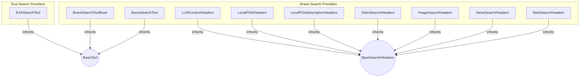

# web_search_providers Module
This module provides tools for integrating various web search APIs, including Brave Search and Exa, with defined schemas for search parameters and headers.

<!-- DIAGRAM_JSON
{
  "nodes": [
    {"id": "BraveBase", "label": "BraveSearchToolBase", "type": "class"},
    {"id": "BraveTool", "label": "BraveSearchTool", "type": "class"},
    {"id": "LLMContextH", "label": "LLMContextHeaders", "type": "class"},
    {"id": "LocalPOIsH", "label": "LocalPOIsHeaders", "type": "class"},
    {"id": "LocalPOIsDescH", "label": "LocalPOIsDescriptionHeaders", "type": "class"},
    {"id": "VideoH", "label": "VideoSearchHeaders", "type": "class"},
    {"id": "ImageH", "label": "ImageSearchHeaders", "type": "class"},
    {"id": "NewsH", "label": "NewsSearchHeaders", "type": "class"},
    {"id": "WebH", "label": "WebSearchHeaders", "type": "class"},
    {"id": "EXATool", "label": "EXASearchTool", "type": "class"},
    {"id": "BaseTool", "label": "BaseTool", "type": "abstract"},
    {"id": "BaseSearchH", "label": "BaseSearchHeaders", "type": "abstract"}
  ],
  "edges": [
    {"source": "BraveBase", "target": "BaseTool", "type": "inheritance"},
    {"source": "BraveTool", "target": "BaseTool", "type": "inheritance"},
    {"source": "LLMContextH", "target": "BaseSearchH", "type": "inheritance"},
    {"source": "LocalPOIsH", "target": "BaseSearchH", "type": "inheritance"},
    {"source": "LocalPOIsDescH", "target": "BaseSearchH", "type": "inheritance"},
    {"source": "VideoH", "target": "BaseSearchH", "type": "inheritance"},
    {"source": "ImageH", "target": "BaseSearchH", "type": "inheritance"},
    {"source": "NewsH", "target": "BaseSearchH", "type": "inheritance"},
    {"source": "WebH", "target": "BaseSearchH", "type": "inheritance"},
    {"source": "EXATool", "target": "BaseTool", "type": "inheritance"}
  ],
  "groups": [
    {"id": "brave_search", "label": "Brave Search Providers", "nodes": ["BraveBase", "BraveTool", "LLMContextH", "LocalPOIsH", "LocalPOIsDescH", "VideoH", "ImageH", "NewsH", "WebH"]},
    {"id": "exa_search", "label": "Exa Search Providers", "nodes": ["EXATool"]}
  ]
}
-->
