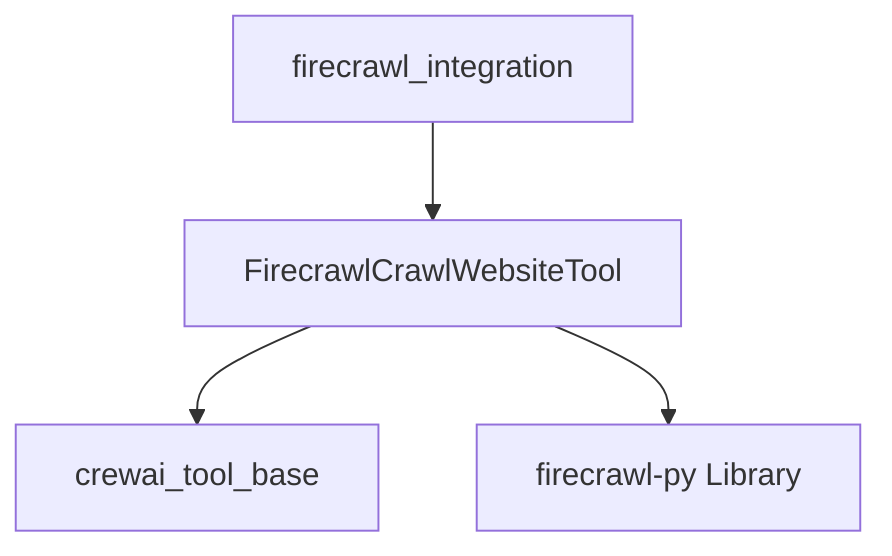

# website_crawler Module Documentation

## Introduction

The `website_crawler` module provides the `FirecrawlCrawlWebsiteTool`, a specialized tool designed for comprehensive website crawling using the Firecrawl v2 API. This module enables agents to extract content from web pages efficiently, supporting various configurations for deep or shallow crawls, sitemap handling, and content formatting. It is a core component within the `crewai_tools_web_scraping` ecosystem, specifically integrating with Firecrawl services to expand web data acquisition capabilities.

## Architecture and Component Relationships

The `website_crawler` module primarily exposes the `FirecrawlCrawlWebsiteTool` class. This tool inherits from `BaseTool` (from the [crewai_tool_base](crewai_tool_base.md) module), adhering to the standard tool interface within CrewAI. It leverages the external `firecrawl-py` library to interact with the Firecrawl v2 API, handling both API key management and flexible crawling configurations.

### `FirecrawlCrawlWebsiteTool`

This class encapsulates the logic for initiating and managing web crawls. Key aspects include:

*   **Initialization (`__init__`)**: Takes an optional `api_key` for Firecrawl. It dynamically handles the installation of the `firecrawl-py` package if it's not already present, ensuring a smooth setup process for developers.
*   **Configuration (`config`)**: Allows extensive customization of the crawling process through a dictionary, including parameters like `max_discovery_depth`, `ignore_sitemap`, `limit`, `allow_external_links`, `allow_subdomains`, `delay`, and `scrape_options` (e.g., `formats`, `only_main_content`, `timeout`). These options directly map to the Firecrawl v2 API's capabilities.
*   **Execution (`_run`)**: The core method that takes a URL and initiates the crawl using the initialized `FirecrawlApp` instance, returning the processed content as per the configured `scrape_options`.

### Module Dependencies

The `website_crawler` module depends on:

*   **`crewai_tool_base`**: Provides the `BaseTool` class, which `FirecrawlCrawlWebsiteTool` extends, ensuring compatibility with the CrewAI tool framework.
*   **`firecrawl_integration`**: This module is a sub-module of `firecrawl_integration`, highlighting its specific role in the broader Firecrawl tooling within CrewAI.
*   **`firecrawl-py`**: An external Python library that facilitates communication with the Firecrawl API, performing the actual web crawling operations.

<!-- DIAGRAM_JSON
{
    "direction": "TD",
    "nodes": [
        {"id": "firecrawl_crawl_website_tool", "label": "FirecrawlCrawlWebsiteTool", "type": "component", "link": null},
        {"id": "crewai_tool_base", "label": "crewai_tool_base", "type": "external", "link": "crewai_tool_base.md"},
        {"id": "firecrawl_integration", "label": "firecrawl_integration", "type": "external", "link": "firecrawl_integration.md"},
        {"id": "firecrawl_app_lib", "label": "firecrawl-py Library", "type": "external", "link": null}
    ],
    "edges": [
        {"source": "firecrawl_crawl_website_tool", "target": "crewai_tool_base"},
        {"source": "firecrawl_crawl_website_tool", "target": "firecrawl_app_lib"},
        {"source": "firecrawl_integration", "target": "firecrawl_crawl_website_tool"}
    ],
    "groups": []
}
-->

