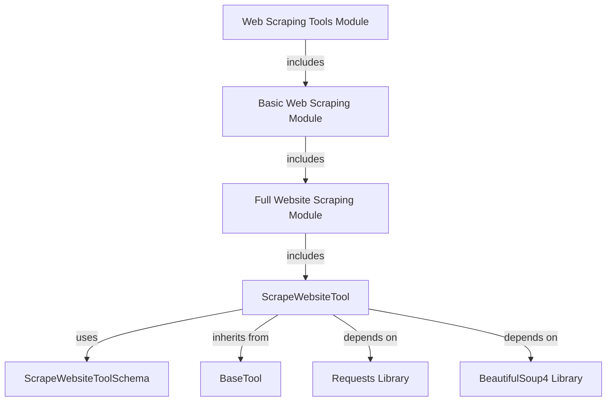

# website_scraper_tool Module Documentation

The `website_scraper_tool` module provides a specialized tool for scraping and extracting textual content from websites. It is a core component within the `crewai-tools` ecosystem, specifically designed for web-based data extraction tasks.

<!-- DIAGRAM_JSON
{
    "direction": "TD",
    "nodes": [
        {"id": "scrape_website_tool", "label": "ScrapeWebsiteTool", "type": "component", "link": null},
        {"id": "scrape_website_tool_schema", "label": "ScrapeWebsiteToolSchema", "type": "component", "link": null},
        {"id": "base_tool", "label": "BaseTool", "type": "external", "link": "crewai_tool_base.md"},
        {"id": "requests_lib", "label": "Requests Library", "type": "external", "link": null},
        {"id": "beautifulsoup_lib", "label": "BeautifulSoup4 Library", "type": "external", "link": null},
        {"id": "full_website_scraping", "label": "Full Website Scraping Module", "type": "external", "link": "full_website_scraping.md"},
        {"id": "basic_web_scraping", "label": "Basic Web Scraping Module", "type": "external", "link": "basic_web_scraping.md"},
        {"id": "crewai_tools_web_scraping", "label": "Web Scraping Tools Module", "type": "external", "link": "crewai_tools_web_scraping.md"}
    ],
    "edges": [
        {"source": "scrape_website_tool", "target": "scrape_website_tool_schema", "label": "uses"},
        {"source": "scrape_website_tool", "target": "base_tool", "label": "inherits from"},
        {"source": "scrape_website_tool", "target": "requests_lib", "label": "depends on"},
        {"source": "scrape_website_tool", "target": "beautifulsoup_lib", "label": "depends on"},
        {"source": "full_website_scraping", "target": "scrape_website_tool", "label": "includes"},
        {"source": "basic_web_scraping", "target": "full_website_scraping", "label": "includes"},
        {"source": "crewai_tools_web_scraping", "target": "basic_web_scraping", "label": "includes"}
    ],
    "groups": []
}
-->



## 1. Module Purpose and Core Functionality

The `website_scraper_tool` module provides the `ScrapeWebsiteTool`, a powerful and flexible tool designed to retrieve the full textual content of a given webpage. It handles the complexities of making HTTP requests and parsing HTML to extract clean, readable text, making it an essential utility for agents requiring web content analysis.

### `ScrapeWebsiteTool`

The `ScrapeWebsiteTool` class extends `BaseTool` (see [crewai_tool_base.md](crewai_tool_base.md)) and serves as the primary interface for web scraping.

**Key Features:**
*   **Website Content Extraction**: Fetches the HTML content of a specified URL and extracts all visible text.
*   **Customizable Requests**: Allows specification of custom `cookies` and `headers` (with sensible defaults) to mimic browser behavior and handle various website requirements.
*   **Input Validation**: Utilizes `ScrapeWebsiteToolSchema` for robust validation of input parameters, ensuring that the `website_url` is always provided.
*   **Dependency Management**: Ensures that the `beautifulsoup4` library is installed, raising an `ImportError` if it's missing, thus providing clear dependency guidance.

**Usage Example:**

```python
from crewai_tools import ScrapeWebsiteTool

# Initialize with a specific website URL
tool = ScrapeWebsiteTool(website_url="https://www.example.com")
content = tool.run()

# Or, provide the URL at runtime
tool = ScrapeWebsiteTool()
content = tool.run(website_url="https://www.another-example.com")
```

### `ScrapeWebsiteToolSchema`

The `ScrapeWebsiteToolSchema` defines the expected input schema for the `ScrapeWebsiteTool`. It inherits from `FixedScrapeWebsiteToolSchema` (which is likely a Pydantic `BaseModel` derivative). Its primary role is to enforce that a `website_url` is always provided when the tool is executed.

**Key Fields:**
*   `website_url` (str): The mandatory URL of the website to be scraped.

## 2. Architecture and Component Relationships

The `website_scraper_tool` module is composed of two primary components: `ScrapeWebsiteTool` and `ScrapeWebsiteToolSchema`.

*   **`ScrapeWebsiteTool`**: This is the operational component. It inherits from `BaseTool`, providing it with the standard interface expected by the CrewAI framework. Internally, it relies on external Python libraries:
    *   **`requests`**: For making HTTP GET requests to fetch webpage content.
    *   **`beautifulsoup4`**: For parsing the fetched HTML content and extracting clean text.
    *   **`re` (Regular Expressions)**: Used for cleaning up the extracted text, removing excessive whitespace and newlines.
    *   **`os`**: Potentially used for retrieving cookie values from environment variables.

*   **`ScrapeWebsiteToolSchema`**: This component defines the data structure for the inputs required by `ScrapeWebsiteTool`. `ScrapeWebsiteTool` uses this schema to validate its arguments, ensuring type correctness and the presence of mandatory fields like `website_url`.

## 3. How the Module Fits into the Overall System

The `website_scraper_tool` module is an integral part of the `crewai_tools_web_scraping` package, specifically nested under `basic_web_scraping` and `full_website_scraping`.

*   **Parent Modules**:
    *   [full_website_scraping.md](full_website_scraping.md): This module likely orchestrates different approaches to scraping an entire website, with `website_scraper_tool` being a key component for extracting content from individual pages.
    *   [basic_web_scraping.md](basic_web_scraping.md): This module provides fundamental web scraping capabilities, where `website_scraper_tool` offers a direct and straightforward way to get page content.
    *   [crewai_tools_web_scraping.md](crewai_tools_web_scraping.md): This top-level module gathers all web scraping related tools, making `website_scraper_tool` available as a general-purpose web content retrieval option alongside other specialized scraping integrations.

This module contributes to the broader CrewAI framework by enabling agents to interact with web content, retrieve information, and process it for various tasks such as research, data analysis, and content generation. Its clear interface and robust implementation make it a reliable choice for agents needing to extract information directly from the web.