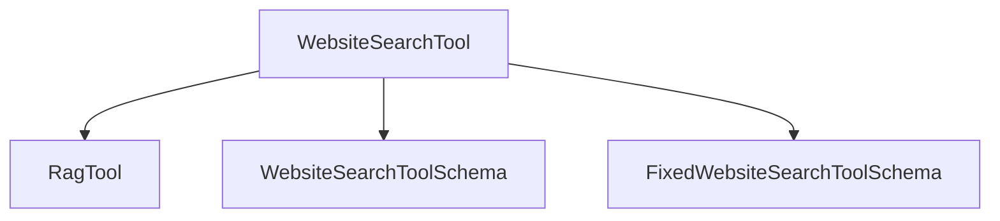

The `website_search` module provides a specialized tool for performing semantic searches within the content of a specific website. It leverages Retrieval Augmented Generation (RAG) principles to deliver highly relevant results by focusing the search scope.

<!-- DIAGRAM_JSON
{
    "direction": "TD",
    "nodes": [
        {"id": "website_search_tool", "label": "WebsiteSearchTool", "type": "component", "link": null},
        {"id": "rag_tool", "label": "RagTool", "type": "external", "link": "crewai_tools_rag_loaders_and_chunkers.md"},
        {"id": "website_search_tool_schema", "label": "WebsiteSearchToolSchema", "type": "external", "link": "crewai_tools_web_search_search_api_schemas.md"},
        {"id": "fixed_website_search_tool_schema", "label": "FixedWebsiteSearchToolSchema", "type": "external", "link": "crewai_tools_web_search_search_api_schemas.md"}
    ],
    "edges": [
        {"source": "website_search_tool", "target": "rag_tool"},
        {"source": "website_search_tool", "target": "website_search_tool_schema"},
        {"source": "website_search_tool", "target": "fixed_website_search_tool_schema"}
    ],
    "groups": []
}
-->


### Module Description

The `website_search` module is designed to enable targeted information retrieval from specific web domains. Its primary component, `WebsiteSearchTool`, extends the capabilities of general RAG tools by allowing users to confine their searches to a pre-defined website or dynamically specify one at runtime. This module is crucial for scenarios requiring precise information extraction from known sources, enhancing the relevance and accuracy of search results for AI agents.

### Core Components

#### `WebsiteSearchTool`

The `WebsiteSearchTool` is the central component of this module. It is a specialized RAG tool that facilitates semantic searching within a specified website's content.

*   **Purpose**: To perform semantic searches on the content of a particular website, returning information relevant to a given query.
*   **Inheritance**: Inherits from `RagTool` (documented in [crewai_tools_rag_loaders_and_chunkers.md](crewai_tools_rag_loaders_and_chunkers.md)), providing core RAG functionalities.
*   **Initialization**:
    *   Can be initialized with a `website` URL, in which case the tool's description and argument schema are updated to reflect a fixed search target.
    *   If `website` is not provided during initialization, it can be passed during the `_run` method.
*   **`add` Method**: Overrides the base `add` method to ingest the website content, categorizing it with `DataType.WEBSITE`.
*   **`_run` Method**: Executes the semantic search. It takes a `search_query` and optional parameters like `website` (if not fixed during initialization), `similarity_threshold`, and `limit` for fine-tuning the search results.

**Code Snippet:**
```python
class WebsiteSearchTool(RagTool):
    name: str = "Search in a specific website"
    description: str = "A tool that can be used to semantic search a query from a specific URL content."
    args_schema: type[BaseModel] = WebsiteSearchToolSchema

    def __init__(self, website: str | None = None, **kwargs: Any) -> None:
        super().__init__(**kwargs)
        if website is not None:
            self.add(website)
            self.description = f"A tool that can be used to semantic search a query from {website} website content."
            self.args_schema = FixedWebsiteSearchToolSchema
            self._generate_description()

    def add(self, website: str) -> None:  # type: ignore[override]
        super().add(website, data_type=DataType.WEBSITE)

    def _run(  # type: ignore[override]
        self,
        search_query: str,
        website: str | None = None,
        similarity_threshold: float | None = None,
        limit: int | None = None,
    ) -> str:
        if website is not None:
            self.add(website)
        return super()._run(
            query=search_query, similarity_threshold=similarity_threshold, limit=limit
        )
```

### Relationships and Dependencies

The `website_search` module, through its `WebsiteSearchTool`, has the following key dependencies:

*   **[crewai_tools_rag_loaders_and_chunkers.md](crewai_tools_rag_loaders_and_chunkers.md)**: Provides the foundational `RagTool` class, which `WebsiteSearchTool` extends. This module is responsible for the core RAG capabilities, including data loading and chunking, that the website search functionality builds upon.
*   **[crewai_tools_web_search_search_api_schemas.md](crewai_tools_web_search_search_api_schemas.md)**: Defines the `WebsiteSearchToolSchema` and `FixedWebsiteSearchToolSchema`, which dictate the expected arguments for the `WebsiteSearchTool`, ensuring proper data validation and structure.

### How it Fits into the Overall System

The `website_search` module is a vital part of the `crewai_tools_web_search` ecosystem, providing a specific and powerful way for agents to interact with web content. It complements broader web search tools by offering a focused approach, allowing agents to extract highly relevant information from trusted or specific web sources without being overwhelmed by the entire internet. This precision makes it invaluable for tasks requiring in-depth research on particular domains, fact-checking, or gathering information from organizational websites.
