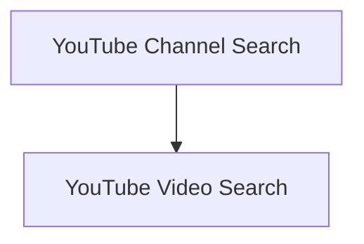

# Youtube Search Tools

## Introduction

The `youtube_search_tools` module provides specialized tools for interacting with YouTube content, enabling semantic search capabilities across both YouTube channels and individual videos. This module is part of the larger `crewai-tools` ecosystem, offering agents the ability to retrieve relevant information from YouTube sources based on natural language queries.

## Architecture Overview

The `youtube_search_tools` module is composed of two primary sub-modules:

1.  **[YouTube Channel Search](youtube_channel_search.md)**: Focuses on searching content within entire YouTube channels.
2.  **[YouTube Video Search](youtube_video_search.md)**: Handles searching content within specific YouTube videos.

These sub-modules leverage underlying RAG (Retrieval Augmented Generation) capabilities to perform semantic searches, allowing for intelligent retrieval of information.

<!-- DIAGRAM_JSON
{
    "direction": "TD",
    "nodes": [
        {"id": "youtube_channel_search", "label": "YouTube Channel Search", "type": "module", "link": "youtube_channel_search.md"},
        {"id": "youtube_video_search", "label": "YouTube Video Search", "type": "module", "link": "youtube_video_search.md"}
    ],
    "edges": [
        {"source": "youtube_channel_search", "target": "youtube_video_search", "label": "Related Search Functionality"}
    ],
    "groups": []
}
-->

## Sub-modules

### [YouTube Channel Search](youtube_channel_search.md)
This sub-module provides the `YoutubeChannelSearchTool`, which allows agents to perform semantic searches across the content of a specified YouTube channel. It is initialized with a YouTube channel handle and facilitates querying the channel's video transcripts and metadata.

### [YouTube Video Search](youtube_video_search.md)
This sub-module includes the `YoutubeVideoSearchTool`, designed for semantic searching within the content of a particular YouTube video. It takes a YouTube video URL for initialization and enables agents to find specific information within that video's content.