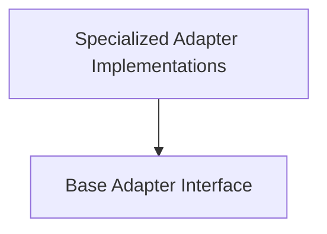

# Adapter Implementations Module

The `adapter_implementations` module in DSPy provides a flexible and extensible framework for integrating various Language Models (LMs) into the DSPy ecosystem. It defines the core `Adapter` interface and includes specialized implementations for enhanced LM interaction, such as improved Pydantic model rendering and two-stage processing for complex reasoning tasks.

This module acts as a crucial intermediary, translating DSPy's structured input and signature definitions into LM-specific prompts and parsing LM outputs back into DSPy's desired formats. It supports features like native function calling, conversation history management, and custom type handling, ensuring seamless communication between DSPy programs and diverse LMs.

## Architecture Overview

The `adapter_implementations` module is structured to provide a clear separation between the foundational adapter interface and its concrete, specialized implementations. The `Base Adapter Interface` defines the common methods and properties expected of any DSPy adapter, while `Specialized Adapter Implementations` extend this base to offer tailored functionalities for specific use cases or LM characteristics.

<!-- DIAGRAM_JSON
{
    "direction": "TD",
    "nodes": [
        {"id": "base_adapter_interface", "label": "Base Adapter Interface", "type": "module", "link": "base_adapter_interface.md"},
        {"id": "specialized_adapters", "label": "Specialized Adapter Implementations", "type": "module", "link": "specialized_adapters.md"}
    ],
    "edges": [
        {"source": "specialized_adapters", "target": "base_adapter_interface"}
    ],
    "groups": []
}
-->

## Sub-modules

### [Base Adapter Interface](base_adapter_interface.md)
Defines the foundational interface and core logic for all DSPy adapters, handling prompt formatting, LM calls, and output parsing. This module provides the `Adapter` class, which serves as the abstract base for all concrete adapter implementations.

### [Specialized Adapter Implementations](specialized_adapters.md)
Provides concrete adapter implementations that extend the base `Adapter` functionality for specific use cases. This includes `BAMLAdapter` for optimizing Pydantic model rendering in LM interactions and `TwoStepAdapter` for managing complex, multi-stage LM processing, especially useful with reasoning models that struggle with direct structured outputs.