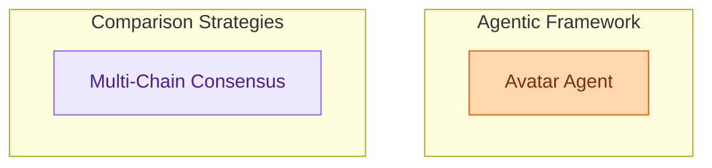

# Advanced Prediction Strategies
This module offers advanced prediction strategies, including an agentic framework for iterative task accomplishment with tool use, and a mechanism for comparing and synthesizing results from multiple prediction chains to achieve robust outputs.

<!-- DIAGRAM_JSON
{
    "direction": "TD",
    "nodes": [
        {"id": "avatar_agent", "label": "Avatar Agent", "type": "module", "link": "avatar_agent.md"},
        {"id": "multi_chain_consensus", "label": "Multi-Chain Consensus", "type": "module", "link": "multi_chain_consensus.md"}
    ],
    "edges": [],
    "groups": [
        {"id": "agentic_framework", "label": "Agentic Framework", "role": "generative", "nodes": ["avatar_agent"]},
        {"id": "comparison_strategies", "label": "Comparison Strategies", "role": "analytical", "nodes": ["multi_chain_consensus"]}
    ]
}
-->
