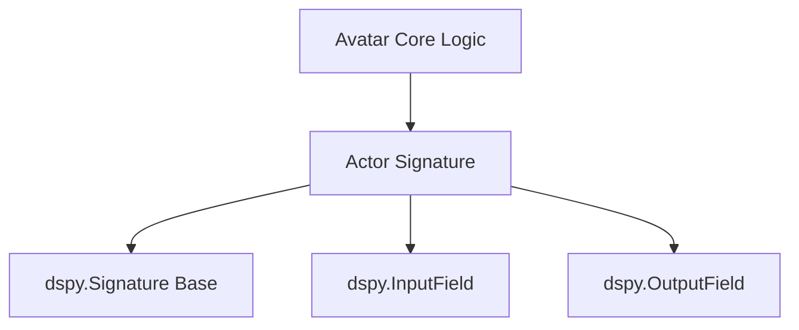

# agent_signature Module Documentation

## Introduction

The `agent_signature` module defines the `Actor` signature, a crucial component for the Avatar agent within the dspy framework. This signature dictates how an agent decides on actions to take, particularly concerning the utilization of available tools to achieve a specified goal. It provides a structured interface for the agent's decision-making process, ensuring clarity and consistency in its operational logic.

## Purpose and Core Functionality

The primary purpose of the `agent_signature` module is to encapsulate the `Actor` class, which inherits from `dspy.Signature`. This class is designed to formalize the input and output requirements for an agent's "actor" role. Specifically, it guides the agent in:

1.  **Understanding the Goal:** Taking a `goal` as input, which represents the task to be accomplished.
2.  **Evaluating Available Tools:** Receiving a list of `tools` that can be utilized.
3.  **Deciding on an Action:** Producing an `action_1` as output, specifying which tool to use and what input to provide. The agent has the flexibility to use no tools and provide a direct answer, or to use one tool multiple times with different inputs.

### Core Component: `dspy.predict.avatar.signatures.Actor`

The `Actor` class is a `dspy.Signature` with the following fields:

*   **`goal` (Input):** A string describing the task the agent needs to complete.
    *   `prefix`: "Goal:"
    *   `desc`: "Task to be accomplished."
*   **`tools` (Input):** A list of strings, where each string represents an available tool.
    *   `prefix`: "Tools:"
    *   `desc`: "list of tools to use"
*   **`action_1` (Output):** An `Action` object, representing the first action the agent decides to take. This includes the chosen tool and its input.
    *   `prefix`: "Action 1:"
    *   `desc`: "1st action to take."

## Architecture and Component Relationships

The `agent_signature` module is a leaf module that provides the `Actor` signature. This signature is fundamental to the operation of the Avatar agent, particularly within its core logic.

<!-- DIAGRAM_JSON
{
    "direction": "TD",
    "nodes": [
        {"id": "actor_signature", "label": "Actor Signature", "type": "component", "link": null},
        {"id": "dspy_signature_base", "label": "dspy.Signature Base", "type": "external", "link": "dspy_signatures.md"},
        {"id": "input_field", "label": "dspy.InputField", "type": "external", "link": "dspy_signatures.md"},
        {"id": "output_field", "label": "dspy.OutputField", "type": "external", "link": "dspy_signatures.md"},
        {"id": "avatar_core_logic", "label": "Avatar Core Logic", "type": "external", "link": "avatar_core_logic.md"}
    ],
    "edges": [
        {"source": "actor_signature", "target": "dspy_signature_base"},
        {"source": "actor_signature", "target": "input_field"},
        {"source": "actor_signature", "target": "output_field"},
        {"source": "avatar_core_logic", "target": "actor_signature"}
    ],
    "groups": []
}
-->

### Component Breakdown:

*   **`Actor Signature`**: The core component of this module, defining the structure for agent decision-making.
*   **`dspy.Signature Base`**: The foundational class from which `Actor` inherits, providing the basic structure for DSPy signatures. (Refer to [dspy_signatures.md](dspy_signatures.md) for more details).
*   **`dspy.InputField` & `dspy.OutputField`**: These are used to define the specific input and output parameters within the `Actor` signature. (Refer to [dspy_signatures.md](dspy_signatures.md) for more details).
*   **`Avatar Core Logic`**: This external module (specifically, the `Avatar` class in [avatar_core_logic.md](avatar_core_logic.md)) utilizes the `Actor` signature to guide its behavior in tool selection and action execution.

## How the Module Fits into the Overall System

The `agent_signature` module is an integral part of the `dspy.predict.avatar` sub-package, which falls under `dspy_prediction_strategies`. It specifically provides the signature for the `Avatar` agent, enabling it to effectively reason about and execute actions using tools.

Its position within the `avatar_agent` module chain highlights its role in defining the behavioral contract for Avatar agents. By standardizing the input (goal, tools) and output (action), it allows the `avatar_core_logic` to implement sophisticated decision-making processes, making the Avatar agent more robust and predictable in its interactions with external tools and environments. This module ensures that the agent's intentions and actions are clearly articulated and understood within the DSPy framework.
