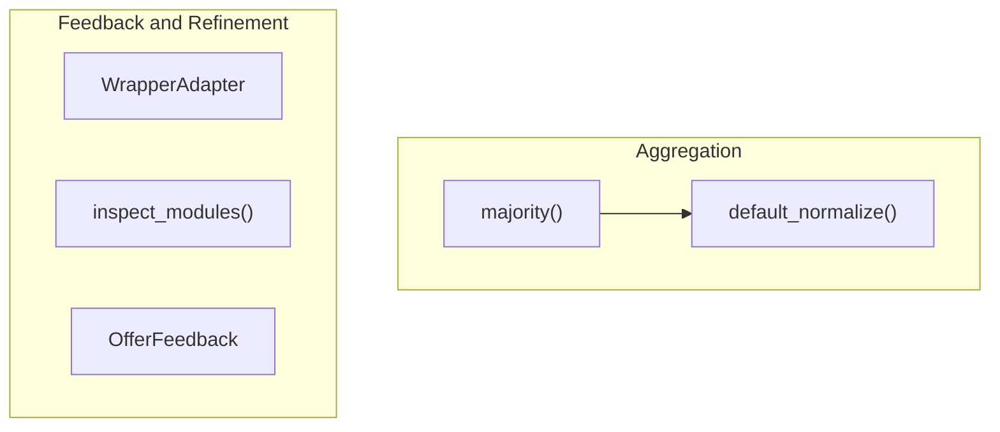

# aggregation_and_feedback
This module provides utilities for aggregating predictions, such as majority voting, and for refining DSPy programs through feedback mechanisms, including module inspection and advice generation.

<!-- DIAGRAM_JSON
{
  "nodes": [
    {"id": "majority", "label": "majority()"},
    {"id": "default_normalize", "label": "default_normalize()"},
    {"id": "WrapperAdapter", "label": "WrapperAdapter"},
    {"id": "inspect_modules", "label": "inspect_modules()"},
    {"id": "OfferFeedback", "label": "OfferFeedback"}
  ],
  "edges": [
    {"source": "majority", "target": "default_normalize"}
  ],
  "groups": [
    {"id": "aggregation", "label": "Aggregation", "nodes": ["majority", "default_normalize"]},
    {"id": "feedback", "label": "Feedback / Refinement", "nodes": ["WrapperAdapter", "inspect_modules", "OfferFeedback"]}
  ]
}
-->
