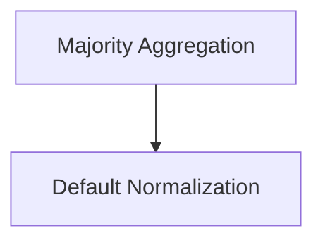

# Aggregation Logic Module

## Introduction

The `aggregation_logic` module provides utilities for aggregating predictions from multiple completions, primarily using a majority voting mechanism. This module is crucial for consolidating results from various prediction strategies into a single, coherent output, enhancing the robustness and accuracy of the overall system.

## Architecture Overview

This module is composed of two main sub-modules:

*   **Default Normalization**: Handles the pre-processing of text for consistent comparison.
*   **Majority Aggregation**: Implements the core logic for selecting the most frequent prediction.

<!-- DIAGRAM_JSON
{
    "direction": "TD",
    "nodes": [
        {"id": "majority_aggregation", "label": "Majority Aggregation", "type": "module", "link": "majority_aggregation.md"},
        {"id": "default_normalization", "label": "Default Normalization", "type": "module", "link": "default_normalization.md"}
    ],
    "edges": [
        {"source": "majority_aggregation", "target": "default_normalization"}
    ],
    "groups": []
}
-->

## Sub-modules

### [Majority Aggregation](majority_aggregation.md)

This sub-module contains the primary function (`majority`) responsible for determining the most common prediction among a list of completions. It utilizes a configurable normalization function to ensure consistent comparison of prediction values and prioritizes earlier completions in case of ties.

### [Default Normalization](default_normalization.md)

This sub-module provides `default_normalize`, a utility function that performs basic text normalization. This normalization is applied to prediction values before aggregation to ensure that semantically identical but syntactically different predictions are treated as the same during the majority voting process. It often relies on an external `normalize_text` function for its core logic.