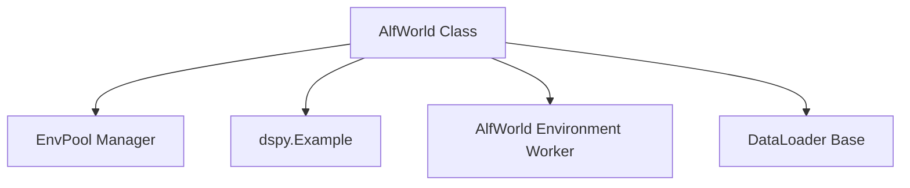

# `alfworld_data_loader` Module Documentation

The `alfworld_data_loader` module is a specialized component within the `dspy.datasets.alfworld` package, dedicated to efficiently loading and managing the AlfWorld dataset. Its primary role is to set up the necessary environment for interacting with AlfWorld tasks and to partition the dataset into training and development sets.

## Core Functionality

The `alfworld_data_loader` module revolves around the `AlfWorld` class, which encapsulates the logic for dataset initialization and environment management. It provides a structured way to access the AlfWorld tasks for various DSPy experiments and evaluations.

## Architecture and Component Relationships

<!-- DIAGRAM_JSON
{
    "direction": "TD",
    "nodes": [
        {"id": "alfworld_class", "label": "AlfWorld Class", "type": "component", "link": null},
        {"id": "env_pool_manager", "label": "EnvPool Manager", "type": "component", "link": null},
        {"id": "dspy_example", "label": "dspy.Example", "type": "external", "link": "dspy_primitives.md"},
        {"id": "alfworld_environment_worker", "label": "AlfWorld Environment Worker", "type": "external", "link": "alfworld_environment_worker.md"},
        {"id": "dataloader_base", "label": "DataLoader Base", "type": "external", "link": "dataset_base_components.md"}
    ],
    "edges": [
        {"source": "alfworld_class", "target": "env_pool_manager"},
        {"source": "alfworld_class", "target": "dspy_example"},
        {"source": "alfworld_class", "target": "alfworld_environment_worker"},
        {"source": "alfworld_class", "target": "dataloader_base"}
    ],
    "groups": []
}
-->

### Components

*   **`AlfWorld` Class**: The central component of this module. It manages the loading, shuffling, and partitioning of the AlfWorld dataset. It also initializes and manages an `EnvPool` for concurrent environment interactions. This class is designed to provide `trainset` and `devset` ready for use in DSPy programs.

*   **`EnvPool` Manager**: An internal component (initialized within `AlfWorld`) responsible for creating and managing a pool of AlfWorld environments. This allows for parallel execution of environment interactions, improving efficiency during data loading and evaluation.

### External Dependencies

*   **`dspy.Example`**: Used by the `AlfWorld` class to represent individual data instances within the dataset. It provides a standardized way to structure input and output fields for DSPy modules. Refer to [dspy_primitives.md](dspy_primitives.md) for more information on core DSPy primitives.

*   **`AlfWorld Environment Worker`**: The `AlfWorld` class relies on environment workers (managed by the `EnvPool`) to interact with the AlfWorld environments. These workers handle the actual simulation and state transitions within the AlfWorld tasks. Refer to [alfworld_environment_worker.md](alfworld_environment_worker.md) for details on the `env_worker` component.

*   **`DataLoader Base`**: Conceptually, the `AlfWorld` class acts as a specialized data loader. It aligns with the general principles and interfaces defined by base data loading components within DSPy. Refer to [dataset_base_components.md](dataset_base_components.md) for more information on the `DataLoader` base class.

## Integration with the Overall System

The `alfworld_data_loader` module plays a crucial role in the broader `dspy_datasets` ecosystem by providing the AlfWorld dataset in a format compatible with DSPy's programming model. It integrates with:

*   **`dspy_datasets`**: As a specialized dataset loader, it is a key part of the `dspy_datasets` module, making AlfWorld available alongside other benchmark datasets like GSM8K and MATH.
*   **DSPy Programs**: The `trainset` and `devset` exposed by the `AlfWorld` class are directly consumed by DSPy programs for training, development, and evaluation of language model pipelines.
*   **`dspy_evaluation`**: The prepared datasets are essential for evaluating the performance of DSPy modules and programs on AlfWorld tasks, often in conjunction with metrics defined in the `dspy_evaluation` module.
