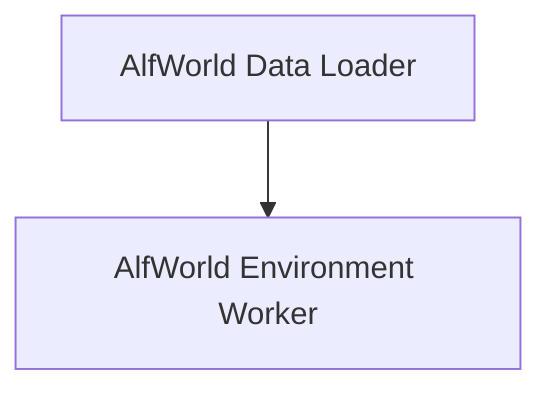

# AlfWorld Dataset Module

## Introduction

The `alfworld_dataset` module provides functionalities for integrating and managing the AlfWorld environment within DSPy. It includes components for loading and preparing the AlfWorld dataset and an environment worker for interacting with the AlfredTWEnv instances.

## Architecture Overview

The `alfworld_dataset` module is composed of two primary sub-modules:

1.  **AlfWorld Data Loader**: Responsible for initializing the AlfWorld dataset, shuffling, and splitting it into training and development sets.
2.  **AlfWorld Environment Worker**: Manages individual AlfredTWEnv instances, handling commands for environment initialization and step-by-step interactions.

These components work together to provide a robust framework for running agents in the AlfWorld environment and evaluating their performance.

<!-- DIAGRAM_JSON
{
    "direction": "TD",
    "nodes": [
        {"id": "alfworld_data_loader", "label": "AlfWorld Data Loader", "type": "module", "link": "alfworld_data_loader.md"},
        {"id": "alfworld_environment_worker", "label": "AlfWorld Environment Worker", "type": "module", "link": "alfworld_environment_worker.md"}
    ],
    "edges": [
        {"source": "alfworld_data_loader", "target": "alfworld_environment_worker"}
    ],
    "groups": []
}
-->

## Sub-modules

*   [AlfWorld Data Loader](alfworld_data_loader.md): Initializes and manages the AlfWorld dataset.
*   [AlfWorld Environment Worker](alfworld_environment_worker.md): Manages interactions with the AlfredTWEnv instances.