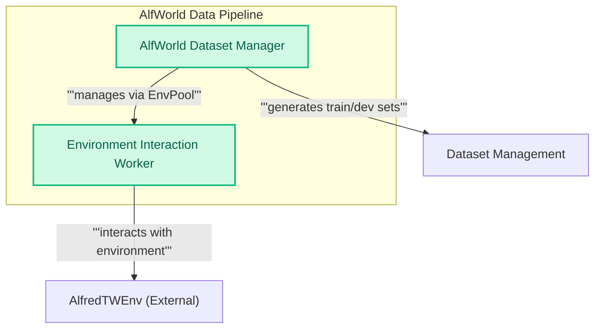

## AlfWorld Dataset Module
This module provides the `AlfWorld` dataset, including an `AlfWorld` class for managing the dataset creation and an `env_worker` function to interact with the external `AlfredTWEnv` for environment steps.

<!-- DIAGRAM_JSON
{
    "direction": "TD",
    "nodes": [
        {
            "id": "alfworld_manager",
            "label": "AlfWorld Dataset Manager",
            "type": "component",
            "link": null
        },
        {
            "id": "env_worker",
            "label": "Environment Interaction Worker",
            "type": "component",
            "link": null
        },
        {
            "id": "alfworld_env",
            "label": "AlfredTWEnv (External)",
            "type": "external",
            "link": null
        },
        {
            "id": "dataset_management",
            "label": "Dataset Management",
            "type": "external",
            "link": "dataset_management.md"
        }
    ],
    "edges": [
        {
            "source": "alfworld_manager",
            "target": "dataset_management",
            "label": "generates train/dev sets"
        },
        {
            "source": "alfworld_manager",
            "target": "env_worker",
            "label": "manages via EnvPool"
        },
        {
            "source": "env_worker",
            "target": "alfworld_env",
            "label": "interacts with environment"
        }
    ],
    "groups": [
        {
            "id": "alfworld_data_pipeline",
            "label": "AlfWorld Data Pipeline",
            "role": "data",
            "nodes": [
                "alfworld_manager",
                "env_worker"
            ]
        }
    ]
}
-->

