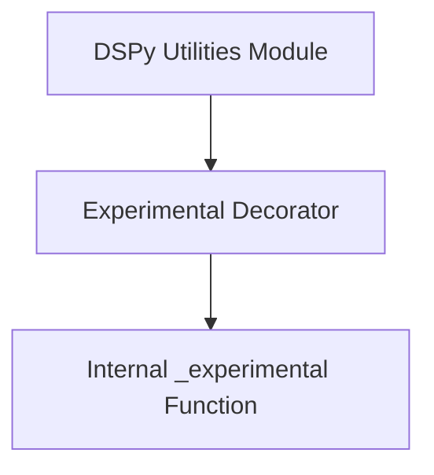

# annotation_utilities Module Documentation

## Introduction
The `annotation_utilities` module provides essential tools for marking functions with specific annotations, primarily to denote their experimental status within the DSPy framework. This module ensures that developers can clearly identify and manage features that are still under development or subject to change.

## Purpose and Core Functionality
The primary purpose of `annotation_utilities` is to offer a standardized way to apply metadata to functions, indicating their stability level. Its core functionality revolves around the `decorator` component, which acts as a factory for creating function decorators.

### Core Components

#### `dspy.utils.annotation.decorator`
This component is a higher-order function that generates a decorator. When applied to a function, it wraps the original function with an `_experimental` utility, typically adding attributes or modifying its behavior to signal its experimental status and associated version. This is crucial for managing the lifecycle of features, allowing the framework to provide warnings or specific handling for experimental APIs.

## Architecture and Component Relationships

The `annotation_utilities` module is a straightforward utility module focusing on function annotation. It integrates with the broader `dspy_utilities` to provide foundational support for framework development.

<!-- DIAGRAM_JSON
{
    "direction": "TD",
    "nodes": [
        {"id": "decorator", "label": "Experimental Decorator", "type": "component", "link": null},
        {"id": "_experimental_func", "label": "Internal _experimental Function", "type": "component", "link": null},
        {"id": "dspy_utilities", "label": "DSPy Utilities Module", "type": "external", "link": "dspy_utilities.md"}
    ],
    "edges": [
        {"source": "decorator", "target": "_experimental_func"},
        {"source": "dspy_utilities", "target": "decorator"}
    ],
    "groups": []
}
-->

### Component Breakdown

*   **Experimental Decorator (`decorator`)**: The entry point for applying experimental annotations. It uses an internal helper to perform the actual wrapping.
*   **Internal `_experimental` Function (`_experimental_func`)**: This is an internal helper function (not directly exposed as a core component but used by `decorator`) that handles the logic of marking a function as experimental, potentially injecting metadata or modifying its runtime behavior.

### Module Relationship

The `annotation_utilities` module is a child of the `dspy_utilities` module, providing a specific annotation utility that can be leveraged by other parts of the DSPy framework for feature management.

## How the Module Fits into the Overall System
The `annotation_utilities` module plays a small but significant role in the overall DSPy system by enforcing consistency in how experimental features are flagged and managed. By using the `decorator` provided here, developers can ensure that new or unstable functionalities are clearly identifiable, which aids in documentation, deprecation warnings, and controlled rollout strategies. It's a foundational utility that supports the development and maintenance of a robust and evolving framework.
