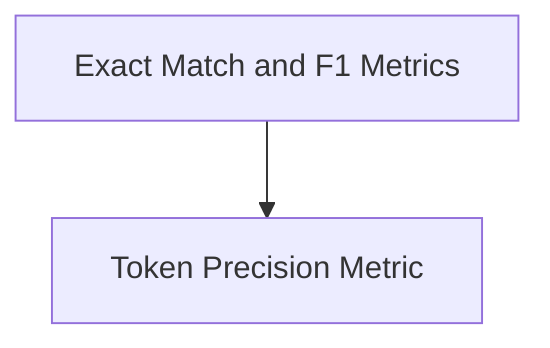

# Answer Comparison Metrics

The `answer_comparison_metrics` module provides a set of utilities for evaluating the quality of predicted answers against reference answers. It includes functions for assessing exact matches, token-level precision, and HotPotQA-style F1 scores.

## Architecture

The module is structured into two main sub-modules:
- **Exact Match and F1 Metrics**: Focuses on direct answer comparison and F1-score calculations.
- **Token Precision Metric**: Handles token-level precision evaluations.

<!-- DIAGRAM_JSON
{
    "direction": "TD",
    "nodes": [
        {"id": "exact_match_and_f1_metrics", "label": "Exact Match and F1 Metrics", "type": "module", "link": "exact_match_and_f1_metrics.md"},
        {"id": "token_precision_metric", "label": "Token Precision Metric", "type": "module", "link": "token_precision_metric.md"}
    ],
    "edges": [
        {"source": "exact_match_and_f1_metrics", "target": "token_precision_metric"}
    ],
    "groups": []
}
-->

## Sub-modules

### [Exact Match and F1 Metrics](exact_match_and_f1_metrics.md)
This sub-module contains functions for evaluating answers based on exact match and HotPotQA-style F1 score. Key functionalities include `answer_exact_match` for strict or F1-thresholded comparisons and `HotPotF1` for specialized HotPotQA F1 scoring.

### [Token Precision Metric](token_precision_metric.md)
This sub-module is responsible for calculating the token-level precision of a predicted answer against a ground truth. The `precision_score` function normalizes text and computes the ratio of overlapping tokens.