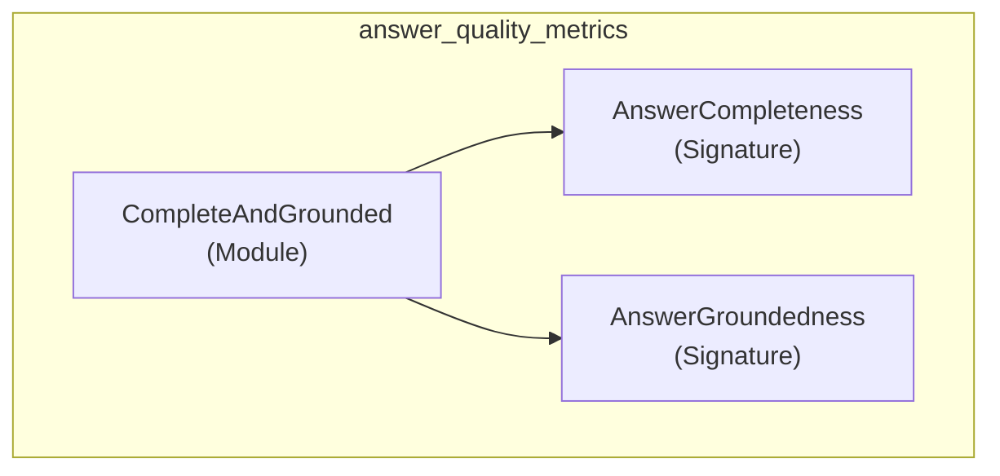

# answer_quality_metrics
This module provides components for evaluating the quality of AI system responses, focusing on completeness against ground truth and groundedness in retrieved context. It includes a combined metric for overall answer quality.

<!-- DIAGRAM_JSON
{
    "nodes": [
        {
            "id": "CompleteAndGrounded",
            "label": "CompleteAndGrounded",
            "type": "Module"
        },
        {
            "id": "AnswerCompleteness",
            "label": "AnswerCompleteness",
            "type": "Signature"
        },
        {
            "id": "AnswerGroundedness",
            "label": "AnswerGroundedness",
            "type": "Signature"
        }
    ],
    "edges": [
        {
            "source": "CompleteAndGrounded",
            "target": "AnswerCompleteness",
            "label": "uses"
        },
        {
            "source": "CompleteAndGrounded",
            "target": "AnswerGroundedness",
            "label": "uses"
        }
    ],
    "groups": []
}
-->
