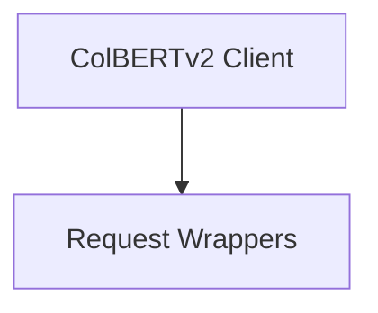

# API Integration Module

This module provides functionalities for integrating with external APIs, specifically focusing on the ColBERTv2 retrieval service. It offers a client for making retrieval requests and utility wrappers for underlying API calls.

## Architecture Overview

The `api_integration` module is structured into the following sub-modules:

<!-- DIAGRAM_JSON
{
    "direction": "TD",
    "nodes": [
        {"id": "colbertv2_client", "label": "ColBERTv2 Client", "type": "module", "link": "colbertv2_client.md"},
        {"id": "request_wrappers", "label": "Request Wrappers", "type": "module", "link": "request_wrappers.md"}
    ],
    "edges": [
        {"source": "colbertv2_client", "target": "request_wrappers"}
    ],
    "groups": []
}
-->

## Sub-modules

### [ColBERTv2 Client](colbertv2_client.md)
This sub-module contains the `ColBERTv2` class, which acts as a Python client for interacting with the ColBERTv2 retrieval service. It encapsulates the logic for constructing and sending retrieval requests.

### [Request Wrappers](request_wrappers.md)
This sub-module provides utility functions such as `colbertv2_get_request_v2_wrapped` and `colbertv2_post_request_v2_wrapped` that serve as direct wrappers for making GET and POST requests to the ColBERTv2 API. These functions simplify the interaction with the underlying API by handling the request parameters and responses.