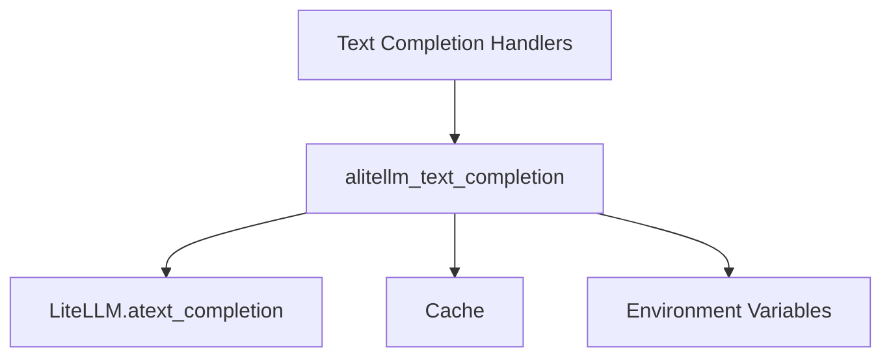

# Async Text Completion Module

The `async_text_completion` module is a crucial component within the DSPy framework, specifically designed to handle asynchronous text completion requests using the LiteLLM library. It provides the core functionality for interacting with various language models (LLMs) to generate text in an asynchronous manner, enabling non-blocking operations and improved performance in applications requiring concurrent LLM calls.

## Core Functionality

The primary function of this module is `alitellm_text_completion`, which orchestrates the asynchronous interaction with LiteLLM for text generation.

### `alitellm_text_completion`

```python
async def alitellm_text_completion(request: dict[str, Any], num_retries: int, cache: dict[str, Any] | None = None)
```

This asynchronous function takes a request dictionary, the number of retries, and an optional cache, then processes the request to generate text.

**Key responsibilities:**
*   **Request Preprocessing:** Extracts and prepares parameters such as the model name, API key, and base URL from the `request` dictionary. It supports dynamic API key and base URL retrieval from environment variables (e.g., `OPENAI_API_KEY`, `ANTHROPIC_API_BASE`).
*   **Prompt Construction:** Transforms a list of messages within the request into a single, cohesive prompt string suitable for LiteLLM's text completion API.
*   **LiteLLM Integration:** Calls `litellm.atext_completion` to perform the actual asynchronous text completion, passing along the processed parameters, retry strategy (exponential backoff), and a DSPy identifier in the headers.
*   **Caching:** Incorporates caching logic, allowing for either explicit cache configuration or disabling it by default if not provided.

**Parameters:**
*   `request` (`dict[str, Any]`): A dictionary containing the text completion request details, including `model`, `messages`, `api_key`, `api_base`, and other LiteLLM compatible parameters.
*   `num_retries` (`int`): The number of times to retry the request in case of failure.
*   `cache` (`dict[str, Any] | None`): An optional dictionary for caching configuration. If `None`, caching is disabled.

## Architecture and Component Relationships

The `async_text_completion` module, particularly the `alitellm_text_completion` function, acts as an intermediary between DSPy's higher-level components that require text generation and the underlying LiteLLM library.

<!-- DIAGRAM_JSON
{
    "direction": "TD",
    "nodes": [
        {"id": "alitellm_text_completion", "label": "alitellm_text_completion", "type": "component", "link": null},
        {"id": "litellm_atext_completion", "label": "LiteLLM.atext_completion", "type": "external", "link": null},
        {"id": "cache", "label": "Cache", "type": "external", "link": "cache_operations.md"},
        {"id": "environment_variables", "label": "Environment Variables", "type": "external", "link": null},
        {"id": "text_completion_handlers", "label": "Text Completion Handlers", "type": "external", "link": "text_completion_handlers.md"}
    ],
    "edges": [
        {"source": "alitellm_text_completion", "target": "litellm_atext_completion"},
        {"source": "alitellm_text_completion", "target": "cache"},
        {"source": "alitellm_text_completion", "target": "environment_variables"},
        {"source": "text_completion_handlers", "target": "alitellm_text_completion"}
    ],
    "groups": []
}
-->


*   **`alitellm_text_completion`**: The core function of this module, responsible for handling asynchronous text completion requests.
*   **`LiteLLM.atext_completion`**: An external dependency, this is the actual asynchronous LiteLLM client function that communicates with the language models.
*   **`Cache`**: The module interacts with caching mechanisms, potentially managed by other DSPy components (e.g., `cache_operations` module) to store and retrieve previous LLM responses.
*   **`Environment Variables`**: API keys and base URLs for different LLM providers are often sourced from environment variables, providing a flexible configuration mechanism.
*   **`text_completion_handlers`**: This module is a sub-module of `text_completion_handlers` (which also contains `sync_text_completion`), indicating its role as one of the ways to handle text completion within the DSPy client ecosystem.

## How it Fits into the Overall System

The `async_text_completion` module serves as the primary gateway for DSPy programs to perform asynchronous text generation. It is leveraged by various DSPy modules and optimizers that require non-blocking calls to LLMs for tasks such as prompt optimization, few-shot learning, and complex multi-turn interactions. Its asynchronous nature ensures that DSPy applications can remain responsive and efficient, especially when dealing with multiple concurrent LLM operations or integrating with asynchronous workflows.

It is a specialized part of the broader [litellm_api_clients.md](litellm_api_clients.md) module, focusing specifically on asynchronous text completion as opposed to chat completion or synchronous operations. This specialization allows for clear separation of concerns and optimized handling of distinct LLM interaction patterns within DSPy.
