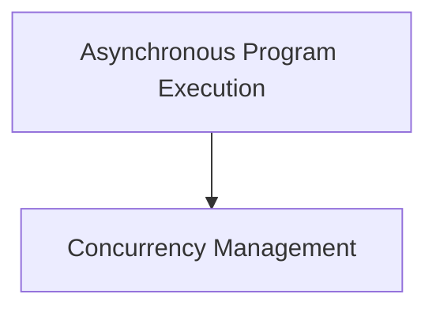

# Asynchronization Utilities Module

## Introduction

The `asynchronization_utilities` module provides essential tools for managing asynchronous program execution and concurrency within the dspy framework. It enables the seamless conversion of synchronous operations into asynchronous ones while ensuring proper context preservation and controlled resource utilization.

## Architecture Overview

The module is structured into two main sub-modules: [async_program_execution](async_program_execution.md) and [concurrency_management](concurrency_management.md). These components work together to facilitate robust asynchronous behavior.

<!-- DIAGRAM_JSON
{
    "direction": "TD",
    "nodes": [
        {"id": "async_program_execution", "label": "Asynchronous Program Execution", "type": "module", "link": "async_program_execution.md"},
        {"id": "concurrency_management", "label": "Concurrency Management", "type": "module", "link": "concurrency_management.md"}
    ],
    "edges": [
        {"source": "async_program_execution", "target": "concurrency_management"}
    ],
    "groups": []
}
-->

## Sub-module Functionality

*   **[Asynchronous Program Execution](async_program_execution.md)**: This sub-module is responsible for transforming synchronous Python functions into their asynchronous counterparts. It ensures that the execution context and thread-local overrides are correctly managed during asynchronous calls.

*   **[Concurrency Management](concurrency_management.md)**: This sub-module provides a centralized mechanism to limit the number of concurrent asynchronous operations. It uses a `CapacityLimiter` to prevent resource exhaustion and ensure stable performance.
