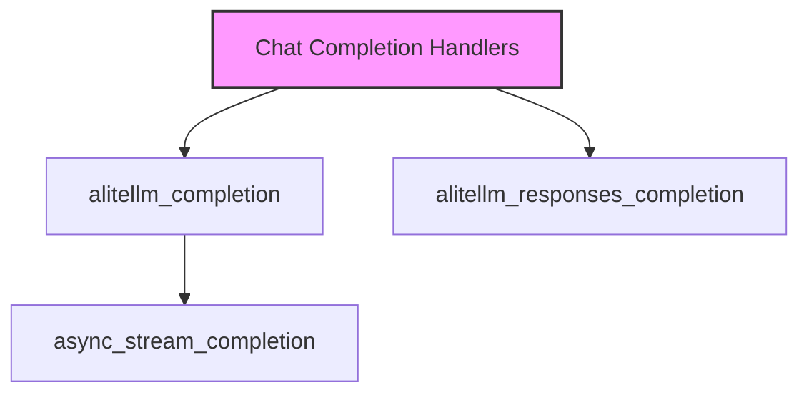

# Asynchronous Handlers Module

## Introduction
The `asynchronous_handlers` module is a crucial part of the DSPy client ecosystem, specifically designed to manage asynchronous interactions with the LiteLLM API for chat and text completion services. This module provides non-blocking functions that enable efficient handling of AI model responses, including streaming capabilities, ensuring that applications remain responsive during API calls.

## Purpose and Core Functionality
This module encapsulates the logic for making asynchronous API requests to language models via LiteLLM. Its primary goal is to provide a seamless and performant way to interact with various LLMs, abstracting away the complexities of asynchronous programming and API integration.

The core functionalities include:
-   **Asynchronous Chat Completions**: Initiating and managing non-blocking chat completion requests.
-   **Asynchronous Response Handling**: Processing and returning responses from asynchronous chat completion calls.
-   **Asynchronous Streaming**: Supporting the real-time streaming of model responses for improved user experience.

## Architecture and Component Relationships

The `asynchronous_handlers` module works in conjunction with its parent module, [chat_completion_handlers](chat_completion_handlers.md), to offer a complete suite of chat completion functionalities. It relies heavily on the `litellm` library for making the actual API calls to language models.

<!-- DIAGRAM_JSON
{
    "direction": "TD",
    "nodes": [
        {"id": "alitellm_completion", "label": "alitellm_completion", "type": "component", "link": null},
        {"id": "alitellm_responses_completion", "label": "alitellm_responses_completion", "type": "component", "link": null},
        {"id": "async_stream_completion", "label": "async_stream_completion", "type": "component", "link": null},
        {"id": "chat_completion_handlers", "label": "Chat Completion Handlers", "type": "external", "link": "chat_completion_handlers.md"}
    ],
    "edges": [
        {"source": "alitellm_completion", "target": "async_stream_completion"},
        {"source": "chat_completion_handlers", "target": "alitellm_completion"},
        {"source": "chat_completion_handlers", "target": "alitellm_responses_completion"}
    ],
    "groups": []
}
-->

### Core Components:

1.  **`dspy.clients.lm.alitellm_completion`**
    *   **Purpose**: This asynchronous function handles chat completion requests using the LiteLLM library. It intelligently determines whether a streaming completion function is available and utilizes it if present; otherwise, it defaults to a standard asynchronous completion call.
    *   **Details**: It prepares the request by managing cache settings, removing internal `rollout_id` and `headers` before passing the request to `litellm.acompletion`. It also ensures DSPy-specific identifiers are added to request headers.

2.  **`dspy.clients.lm.alitellm_responses_completion`**
    *   **Purpose**: This function is responsible for processing and returning asynchronous responses from LiteLLM. It specifically converts chat requests into a format suitable for `litellm.aresponses`.
    *   **Details**: Similar to `alitellm_completion`, it handles cache and headers, but its key role is adapting the request structure for response retrieval and invoking `litellm.aresponses` for efficient asynchronous response handling.

3.  **`dspy.clients.lm.async_stream_completion`**
    *   **Purpose**: This is an internal asynchronous helper function designed to execute a streaming completion. It's typically invoked by `alitellm_completion` when streaming is enabled and a `stream_completion` function is provided.
    *   **Details**: It directly calls the underlying `stream_completion` function with the request and cache arguments, facilitating real-time data flow from the language model.

## How the Module Fits into the Overall System
The `asynchronous_handlers` module is an integral part of the `dspy.clients.lm` package and directly contributes to the [litellm_api_clients](litellm_api_clients.md) functionality. It serves as the asynchronous counterpart to the [synchronous_handlers](synchronous_handlers.md) module, allowing DSPy applications to leverage non-blocking I/O for improved performance and responsiveness, especially in web services or applications requiring concurrent operations. By abstracting the asynchronous LiteLLM interactions, it provides a consistent and robust interface for all asynchronous language model operations within the DSPy framework.
