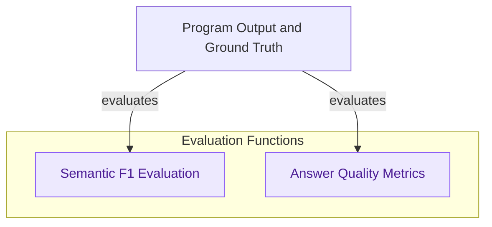

# Automatic Evaluation Metrics
This module provides automated evaluation metrics for language model programs, including semantic F1 score, recall, precision, answer completeness, and groundedness, leveraging LLMs for nuanced comparison.

<!-- DIAGRAM_JSON
{
    "direction": "TD",
    "nodes": [
        {"id": "semantic_f1_evaluation", "label": "Semantic F1 Evaluation", "type": "module", "link": "semantic_f1_evaluation.md"},
        {"id": "answer_quality_metrics", "label": "Answer Quality Metrics", "type": "module", "link": "answer_quality_metrics.md"},
        {"id": "evaluation_input", "label": "Program Output and Ground Truth", "type": "external"}
    ],
    "edges": [
        {"source": "evaluation_input", "target": "semantic_f1_evaluation", "label": "evaluates"},
        {"source": "evaluation_input", "target": "answer_quality_metrics", "label": "evaluates"}
    ],
    "groups": [
        {"id": "evaluation_functions", "label": "Evaluation Functions", "role": "analytical", "nodes": ["semantic_f1_evaluation", "answer_quality_metrics"]}
    ]
}
-->
