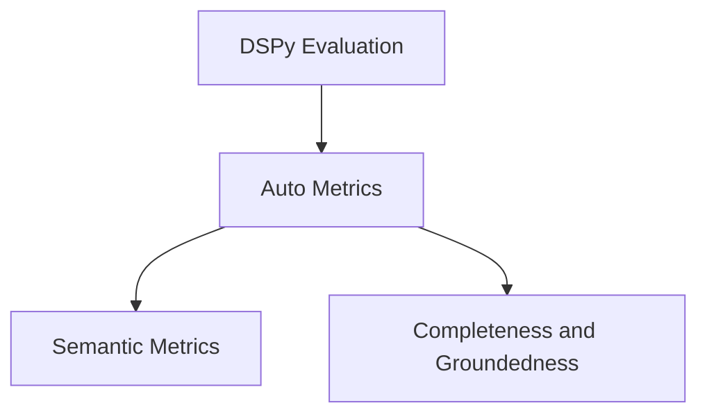

# auto_metrics Module Documentation

## Introduction
The `auto_metrics` module provides advanced, LLM-based evaluation metrics for assessing the quality of system responses. These metrics go beyond traditional keyword matching to evaluate semantic correctness, completeness, and groundedness of generated text. It is a sub-module of the larger [dspy_evaluation.md](dspy_evaluation.md) module.

## Architecture Overview

The `auto_metrics` module is composed of two primary sub-modules:

1.  **Semantic Metrics**: Focuses on evaluating the semantic overlap between system responses and ground truth.
2.  **Completeness and Groundedness**: Assesses how thoroughly a system's response answers a question and how well its claims are supported by provided context.

These sub-modules are designed to be used in conjunction with DSPy's optimization and evaluation frameworks.

<!-- DIAGRAM_JSON
{
    "direction": "TD",
    "nodes": [
        {"id": "dspy_evaluation", "label": "DSPy Evaluation", "type": "module", "link": "dspy_evaluation.md"},
        {"id": "auto_metrics", "label": "Auto Metrics", "type": "module", "link": "auto_metrics.md"},
        {"id": "semantic_metrics", "label": "Semantic Metrics", "type": "module", "link": "semantic_metrics.md"},
        {"id": "completeness_groundedness", "label": "Completeness and Groundedness", "type": "module", "link": "completeness_groundedness.md"}
    ],
    "edges": [
        {"source": "dspy_evaluation", "target": "auto_metrics"},
        {"source": "auto_metrics", "target": "semantic_metrics"},
        {"source": "auto_metrics", "target": "completeness_groundedness"}
    ],
    "groups": []
}
-->

## Sub-modules

### [Semantic Metrics](semantic_metrics.md)
This sub-module focuses on advanced semantic comparison of text. It includes classes like `SemanticF1`, `SemanticRecallPrecision`, and `DecompositionalSemanticRecallPrecision`, which leverage LLMs to determine the semantic overlap and key idea coverage between a system's response and a ground truth.

### [Completeness and Groundedness](completeness_groundedness.md)
This sub-module provides metrics to evaluate how complete and well-supported a system's answer is. It contains components such as `CompleteAndGrounded`, `AnswerCompleteness`, and `AnswerGroundedness`, which assess whether a response fully addresses the question and if its claims are verifiable against provided context.
