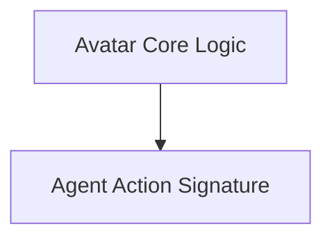

# `avatar_agent` Module Documentation

## Introduction
The `avatar_agent` module provides the core components for implementing an AI agent that can interact with various tools to accomplish a given goal. It includes the `Avatar` class, which orchestrates the agent's decision-making and tool usage, and the `Actor` signature, which defines the agent's expected inputs and outputs.

## Architecture Overview
The `avatar_agent` module is structured around two main components: the `Avatar` class, which serves as the agent's brain, and the `Actor` signature, which formalizes the communication contract for the agent's actions. The `Avatar` class leverages the `Actor` signature to guide its interaction with a predefined set of tools, iteratively refining its actions based on tool outputs until the goal is achieved.

## Sub-modules

*   **[Avatar Core Logic](avatar_core_logic.md)**: This sub-module contains the primary implementation of the `Avatar` agent, detailing how it manages tool interactions and executes tasks.
*   **[Agent Action Signature](agent_signature.md)**: This sub-module defines the structural contract for the agent's actions, outlining the necessary inputs (goal, tools) and the expected output (the next action).

<!-- DIAGRAM_JSON
{
    "direction": "TD",
    "nodes": [
        {"id": "avatar_core_logic", "label": "Avatar Core Logic", "type": "module", "link": "avatar_core_logic.md"},
        {"id": "agent_signature", "label": "Agent Action Signature", "type": "module", "link": "agent_signature.md"}
    ],
    "edges": [
        {"source": "avatar_core_logic", "target": "agent_signature", "label": "uses"}
    ],
    "groups": []
}
-->

