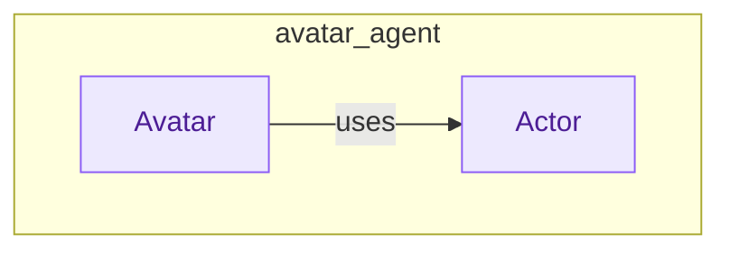

# avatar_agent
The `avatar_agent` module defines an `Avatar` class for orchestrating multi-step agentic reasoning using a specified signature and tools, and an `Actor` signature for defining the agent's decision-making process.

<!-- DIAGRAM_JSON
{
    "nodes": [
        {
            "id": "Avatar",
            "label": "Avatar",
            "type": "class"
        },
        {
            "id": "Actor",
            "label": "Actor",
            "type": "class"
        }
    ],
    "edges": [
        {
            "source": "Avatar",
            "target": "Actor",
            "label": "uses"
        }
    ],
    "groups": [
        {
            "id": "avatar_agent",
            "label": "avatar_agent",
            "nodes": [
                "Avatar",
                "Actor"
            ]
        }
    ]
}
-->
