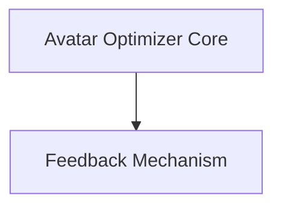

# Avatar Optimizer Module

The `avatar_optimizer` module is a core component within the `dspy.teleprompt` library, designed to iteratively refine and optimize the performance of an `Avatar` agent. It achieves this by evaluating the avatar's output against a given metric, identifying successful and unsuccessful examples, and then generating feedback to improve the avatar's instructions.

## Architecture Overview

The `avatar_optimizer` module orchestrates the optimization process by interacting with the `Avatar` agent, evaluating its performance, and generating refined instructions. It comprises a main optimizer class and auxiliary classes for comparison and instruction generation.

<!-- DIAGRAM_JSON
{
    "direction": "TD",
    "nodes": [
        {"id": "optimizer_core", "label": "Avatar Optimizer Core", "type": "module", "link": "optimizer_core.md"},
        {"id": "feedback_mechanism", "label": "Feedback Mechanism", "type": "module", "link": "feedback_mechanism.md"}
    ],
    "edges": [
        {"source": "optimizer_core", "target": "feedback_mechanism"}
    ],
    "groups": []
}
-->

## Sub-modules

This module is composed of the following sub-modules:

*   **[Avatar Optimizer Core](optimizer_core.md)**: Implements the main logic for optimizing avatar performance through iterative feedback.
*   **[Feedback Mechanism](feedback_mechanism.md)**: Defines the structures and processes for comparing performance, generating feedback, and updating instructions.