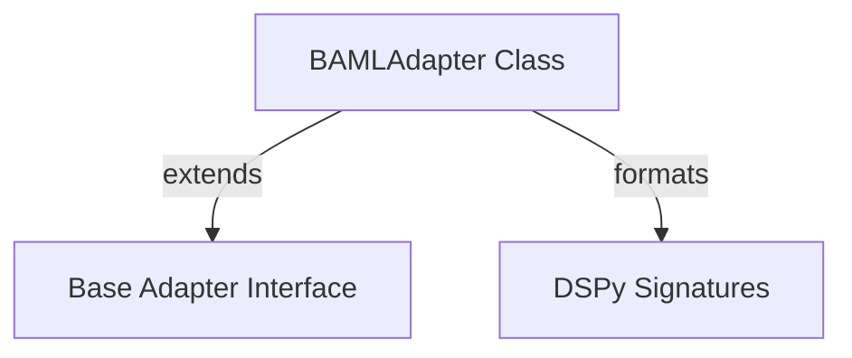

# baml_adapter

The `baml_adapter` module provides a specialized DSPy adapter, `BAMLAdapter`, designed to enhance how complex and nested Pydantic models are rendered for Language Models (LMs). Inspired by the BAML project's JSON formatter, this adapter generates a compact, human-readable schema that is both token-efficient and easier for smaller LMs to parse and follow. It significantly improves the clarity of output requirements by incorporating Pydantic field descriptions as comments directly into the schema.

## Module Architecture

The `baml_adapter` module's core component, `BAMLAdapter`, extends the base adapter interface provided by DSPy and interacts with DSPy signatures and Pydantic models to achieve its specialized formatting.

<!-- DIAGRAM_JSON
{
    "direction": "TD",
    "nodes": [
        {"id": "baml_adapter_BAMLAdapter", "label": "BAMLAdapter Class", "type": "component", "link": null},
        {"id": "base_adapter_interface", "label": "Base Adapter Interface", "type": "external", "link": "base_adapter_interface.md"},
        {"id": "dspy_signatures", "label": "DSPy Signatures", "type": "external", "link": "dspy_signatures.md"}
    ],
    "edges": [
        {"source": "baml_adapter_BAMLAdapter", "target": "base_adapter_interface", "label": "extends"},
        {"source": "baml_adapter_BAMLAdapter", "target": "dspy_signatures", "label": "formats"}
    ],
    "groups": []
}
-->



## Core Components

### BAMLAdapter
The `BAMLAdapter` class is a specialized DSPy adapter that inherits from `JSONAdapter` (which itself is based on the general [Adapter interface](base_adapter_interface.md)). Its primary function is to optimize the rendering of Pydantic models in the context of Language Model interactions.

**Key Features:**
*   **Token-Efficient Schema**: Generates a compact and human-readable schema representation for complex and nested Pydantic output fields, reducing token usage and improving LM comprehension.
*   **Pydantic Field Descriptions**: Automatically includes descriptions from Pydantic fields as comments within the generated schema, providing LMs with crucial context about the expected output structure and content.
*   **Clean JSON for Inputs**: Formats Pydantic input instances into clean, indented JSON, ensuring clarity for the LM.

**Methods:**

#### `format_field_structure(self, signature: type[Signature]) -> str`
This method overrides the base adapter's `format_field_structure` to produce a simplified, BAML-inspired schema for Pydantic models. It structures the output into distinct sections: a general structural explanation, formatted input fields, and specially rendered output fields, followed by a "completed" marker. The output fields leverage a helper function (`_render_type_str`) to generate a concise type string that includes field descriptions as comments, making the schema highly informative for LMs.

#### `format_user_message_content(self, signature: type[Signature], inputs: dict[str, Any], prefix: str = "", suffix: str = "", main_request: bool = False) -> str`
This method overrides the base adapter's `format_user_message_content` to intelligently format the content of user messages. When a Pydantic `BaseModel` instance is provided as an input, it is rendered as clean, indented JSON using `model_dump_json`. For other input types, it falls back to the original DSPy formatter (`original_format_field_value`) to maintain compatibility and consistent formatting. This ensures that LMs receive clearly structured inputs, especially when dealing with complex data objects.

### Usage Example

```python
import dspy
from pydantic import BaseModel, Field
from typing import Literal
from dspy.adapters.baml_adapter import BAMLAdapter # Corrected import path

# 1. Define your Pydantic models
class PatientAddress(BaseModel):
    street: str
    city: str
    country: Literal["US", "CA"]

class PatientDetails(BaseModel):
    name: str = Field(description="Full name of the patient.")
    age: int
    address: PatientAddress | None

# 2. Define a signature using the Pydantic model as an output field
class ExtractPatientInfo(dspy.Signature):
    '''Extract patient information from the clinical note.'''
    clinical_note: str = dspy.InputField()
    patient_info: PatientDetails = dspy.OutputField()

# 3. Configure dspy to use the new adapter
llm = dspy.OpenAI(model="gpt-4.1-mini")
dspy.configure(lm=llm, adapter=BAMLAdapter())

# 4. Run your program
extractor = dspy.Predict(ExtractPatientInfo)
note = "John Doe, 45 years old, lives at 123 Main St, Anytown. Resident of the US."
result = extractor(clinical_note=note)
print(result.patient_info)

# Expected output:
# PatientDetails(name='John Doe', age=45, address=PatientAddress(street='123 Main St', city='Anytown', country='US'))
```

## Relationship to Other Modules

The `baml_adapter` module is a part of the `dspy_adapters` family, specifically categorized under `specialized_adapters`. It builds upon the foundational interfaces defined in the [base_adapter_interface](base_adapter_interface.md) module, which outlines the `Adapter` class that all DSPy adapters extend. It also relies heavily on the definitions and structures provided by [dspy_signatures](dspy_signatures.md) for processing input and output fields, particularly when dealing with the structure of prompts and expected responses.
