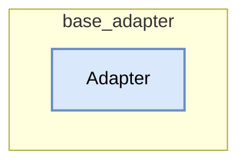

# base_adapter
This module defines the `Adapter` class, serving as the base interface layer between DSPy modules/signatures and Language Models, managing the transformation pipeline from DSPy inputs to LM calls and back to structured outputs.

<!-- DIAGRAM_JSON
{
  "nodes": [
    {"id": "dspy.adapters.base.Adapter", "label": "Adapter", "type": "class"}
  ],
  "edges": [],
  "groups": [
    {"id": "base_adapter", "label": "base_adapter", "nodes": ["dspy.adapters.base.Adapter"]}
  ]
}
-->
