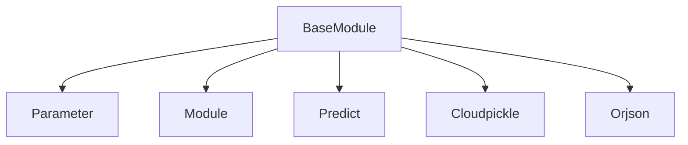

The `base_module_core` module is a foundational component of the DSPy framework, providing the essential building blocks for all other DSPy modules. It defines the `BaseModule` class, which serves as the base class for trainable and composable components within DSPy programs. This module is critical for enabling core functionalities such as parameter management, module introspection, deep copying, and robust serialization of module states and architectures.

### Purpose and Core Functionality

The primary purpose of the `base_module_core` module is to offer a standardized interface and fundamental capabilities for all DSPy modules. Its core functionalities include:

*   **Parameter Management**: It allows for the systematic discovery and management of `Parameter` instances within a module and its sub-modules, enabling unified access for optimization and state manipulation.
*   **Module Introspection**: Provides methods to recursively identify and traverse sub-modules, facilitating the inspection of complex program architectures.
*   **Deep Copying and Resetting**: Implements a custom deep copy mechanism that correctly handles DSPy-specific parameters and sub-modules, along with a utility to create a copy and reset all its parameters.
*   **State Serialization**: Supports saving and loading the operational state of a module to and from JSON or Pickle files, ensuring persistence and reproducibility.
*   **Program Serialization**: Offers the capability to save the entire module architecture and its state using `cloudpickle`, allowing for the complete preservation and transfer of DSPy programs.
*   **Dependency Versioning**: Integrates dependency version checks during loading to warn users about potential compatibility issues, promoting robust deployment.

### Architecture and Component Relationships

The `base_module_core` module, through its `BaseModule` class, establishes key relationships with other core DSPy components:

*   **`Parameter`**: `BaseModule` actively manages instances of `Parameter` (defined in `dspy.predict.parameter`), which represent trainable or configurable elements within a DSPy program.
*   **`Module`**: `BaseModule` can contain and recursively manage other `dspy.primitives.module.Module` instances, forming a hierarchical structure for complex programs.
*   **`Predict`**: During state loading, `BaseModule` has special handling for `dspy.predict.predict.Predict` modules, ensuring their state is loaded correctly.

The module also relies on external libraries for serialization:
*   **`cloudpickle`**: Used for serializing entire DSPy programs, including their architecture and custom components.
*   **`orjson`**: Utilized for efficient JSON serialization and deserialization of module states.

<!-- DIAGRAM_JSON
{
    "direction": "TD",
    "nodes": [
        {"id": "base_module", "label": "BaseModule", "type": "component", "link": null},
        {"id": "parameter", "label": "Parameter", "type": "external", "link": "dspy_prediction_strategies.md"},
        {"id": "dspy_module", "label": "Module", "type": "external", "link": "dspy_module_api.md"},
        {"id": "predict", "label": "Predict", "type": "external", "link": "dspy_prediction_strategies.md"},
        {"id": "cloudpickle", "label": "Cloudpickle", "type": "external", "link": null},
        {"id": "orjson", "label": "Orjson", "type": "external", "link": null}
    ],
    "edges": [
        {"source": "base_module", "target": "parameter"},
        {"source": "base_module", "target": "dspy_module"},
        {"source": "base_module", "target": "predict"},
        {"source": "base_module", "target": "cloudpickle"},
        {"source": "base_module", "target": "orjson"}
    ],
    "groups": []
}
-->

### How it Fits into the Overall System

The `base_module_core` module is the bedrock of the DSPy framework's modularity. Every composable component in DSPy, from simple `Predict` calls to complex multi-stage programs, ultimately inherits from `BaseModule`. This ensures a consistent interface for:

*   **Program Construction**: Developers build DSPy programs by composing `BaseModule`-derived classes.
*   **Optimization**: Optimization algorithms (e.g., in `dspy_teleprompting_optimizers`) interact with programs through the `BaseModule` interface, using `named_parameters` and `parameters` to access and modify trainable components.
*   **Serialization and Deployment**: The `save` and `load` methods allow for the easy serialization of trained programs, enabling their deployment or sharing across different environments.
*   **Experimentation**: `deepcopy` and `reset_copy` are crucial for running multiple experiments or optimizations without affecting the original module.

In essence, `base_module_core` provides the fundamental architectural conventions that allow DSPy programs to be treated as flexible, trainable, and portable computational graphs.