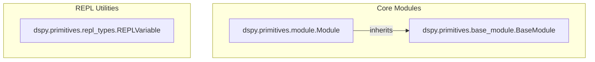

# base_modules
This module defines the foundational `BaseModule` and `Module` classes, which form the core structure for building composable and optimizable DSPy programs. It also includes `REPLVariable` for managing REPL environment data.

<!-- DIAGRAM_JSON
{
  "nodes": [
    {"id": "BM", "label": "BaseModule", "file": "dspy.primitives.base_module"},
    {"id": "M", "label": "Module", "file": "dspy.primitives.module"},
    {"id": "RV", "label": "REPLVariable", "file": "dspy.primitives.repl_types"}
  ],
  "edges": [
    {"source": "M", "target": "BM", "type": "inherits"}
  ],
  "groups": [
    {"id": "Core", "label": "Core Modules", "nodes": ["BM", "M"]},
    {"id": "REPL", "label": "REPL Utilities", "nodes": ["RV"]}
  ]
}
-->
