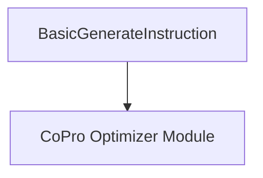

# basic_instruction_generation Module Documentation

## Introduction

The `basic_instruction_generation` module is a fundamental component within the [CoPro Optimizer (COPRO)](copro_optimizer.md) framework, located under `dspy_teleprompting_optimizers`. Its primary role is to establish the initial, basic instruction for a large language model (LLM) before any optimization steps are applied. This module serves as the foundational step in generating a prompt that guides the LLM to perform a specific task effectively.

## Purpose and Core Functionality

The `basic_instruction_generation` module focuses on generating an initial instruction set for an LLM. It defines a `Signature` that outlines the necessary input and output fields for this process. The core functionality is encapsulated within the `BasicGenerateInstruction` component.

### `BasicGenerateInstruction`

`BasicGenerateInstruction` is a `Signature` designed to solicit an initial instruction from an implicit "instruction optimizer". It takes a `basic_instruction` (the raw starting instructions) and is expected to output a `proposed_instruction` (a refined, albeit unoptimized, instruction) and a `proposed_prefix_for_output_field` which helps the model initiate its response correctly.

**Key Fields:**

*   `basic_instruction`: An `InputField` describing the initial instructions provided for optimization.
*   `proposed_instruction`: An `OutputField` for the improved instructions intended for the language model.
*   `proposed_prefix_for_output_field`: An `OutputField` for a string that acts as a prompt prefix, guiding the model to start solving the task.

## Architecture and Component Relationships

This module is a leaf module, containing a single core component: `BasicGenerateInstruction`. This component directly defines the structure for generating the basic instruction. It doesn't have internal sub-components but is inherently tied to the broader `copro_optimizer` module, which utilizes this initial instruction as a starting point for more complex optimization strategies.

## How it Fits into the Overall System

The `basic_instruction_generation` module provides the crucial initial instruction within the `dspy.teleprompt.copro_optimizer`. It acts as the very first step in a teleprompting process, setting the stage for subsequent, more sophisticated instruction refinement and optimization techniques employed by the [CoPro Optimizer](copro_optimizer.md). Without a solid initial instruction from this module, the downstream optimization processes would lack a starting point.

<!-- DIAGRAM_JSON
{
    "direction": "TD",
    "nodes": [
        {"id": "basic_generate_instruction", "label": "BasicGenerateInstruction", "type": "component", "link": null},
        {"id": "copro_optimizer", "label": "CoPro Optimizer Module", "type": "external", "link": "copro_optimizer.md"}
    ],
    "edges": [
        {"source": "basic_generate_instruction", "target": "copro_optimizer"}
    ],
    "groups": []
}
-->

